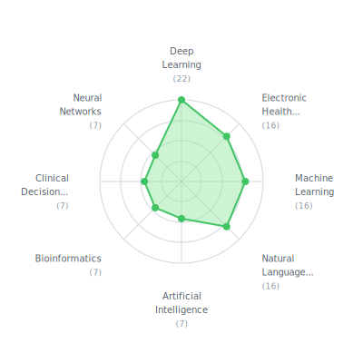
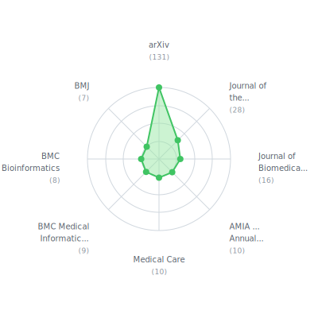

# Reading List

Papers I'm reading, synced from my [Mendeley](https://www.mendeley.com/) library.

36 papers read in the last year

## March 2026

- Composer 2 Technical Report
- [Qwen3 Technical Report](https://arxiv.org/abs/2505.09388v1) — Team (2025)
  > *In this work, we present Qwen3, the latest version of the Qwen model family.*
- [PostTrainBench: Can LLM Agents Automate LLM Post-Training?](https://arxiv.org/abs/2603.08640) — Rank, Bhatnagar, Prabhu, Eisenberg, Nguyen, Bethge, Andriushchenko (2026)
  > *AI agents have become surprisingly proficient at software engineering over the past year, largely due to improvements in reasoning capabilities.*
- [What Matters in Data for DPO?](https://arxiv.org/abs/2508.18312) — Pan, Cai, Chen, Zhong, Wang (2025)
  > *Direct Preference Optimization (DPO) has emerged as a simple and effective approach for aligning large language models (LLMs) with human preferences, bypassing the need for a learned reward model.*
- When AI Builds AI Findings From a Workshop on Automation of AI R&D — Fisher, Scholl, Wildeford, Greenblatt, Albanie, Ballard, Larsen, Toner, Beers, Newman, Khan, Shea-Blymyer, Yee, Acharya (2026)

## February 2026

- [Artificial Hivemind: The Open-Ended Homogeneity of Language Models (and Beyond)](https://arxiv.org/abs/2510.22954v1) — Jiang, Chai, Li, Liu, Fok, Dziri, Tsvetkov, Sap, Albalak, Choi
  > *Large language models (LMs) often struggle to generate diverse, human-like creative content, raising concerns about the long-term homogenization of human thought through repeated exposure to similar...*
- [ChatDoctor: A Medical Chat Model Fine-Tuned on a Large Language Model Meta-AI (LLaMA) Using Medical Domain Knowledge](https://doi.org/10.7759/cureus.40895) — Li, Li, Zhang, Dan, Jiang, Zhang, Li, Li, Zhang, Dan, Jiang, Zhang (2023)
  > *The primary aim of this research was to address the limitations observed in the medical knowledge of prevalent large language models (LLMs) such as ChatGPT, by creating a specialized language model...*
- NVIDIA Nemotron 3: Efficient and Open Intelligence — Mamba

## January 2026

- [End-to-End Test-Time Training for Long Context](https://arxiv.org/abs/2512.23675v2) — Tandon, Dalal, Li, Koceja, Rød, Buchanan, Wang, Leskovec, Koyejo, Hashimoto, Guestrin, Mccaleb, Choi, Sun
  > *We formulate long-context language modeling as a problem in continual learning rather than architecture design.*
- [Towards LLMs Robustness to Changes in Prompt Format Styles](https://arxiv.org/abs/2504.06969) — Ngweta, Kate, Tsay, Rizk (2025)
  > *Large language models (LLMs) have gained popularity in recent years for their utility in various applications.*
- A.I. and Our Economic Future — Jones, Gsb (2026)
  > *Artificial intelligence (A.I.) will likely be the most important technology we have ever developed.*
- [Qwen3-TTS Technical Report](https://arxiv.org/abs/2601.15621) — Hu, Zhu, He, Guo, Zhang, Wang, Guo, Jiang, Hao, Guo, Zhang, Zhang, Yang, Xu, Zhou, Lin (2026)
  > *In this report, we present the Qwen3-TTS series, a family of advanced multilingual, controllable, robust, and streaming text-to-speech models.*
- [GAN-Based Approach for Diabetic Retinopathy Retinal Vasculature Segmentation](https://doi.org/10.3390/BIOENGINEERING11010004) — Sebastian, Elharrouss, Al-Maadeed, Almaadeed (2023)
  > *Most diabetes patients develop a condition known as diabetic retinopathy after having diabetes for a prolonged period.*
- [MedHELM: Holistic Evaluation of Large Language Models for Medical Tasks](https://arxiv.org/abs/2505.23802) — Bedi, Cui, Fuentes, Unell, Wornow, Banda, Kotecha, Keyes, Mai, Oez, Qiu, Jain, Schettini, Kashyap, Fries, Swaminathan, Chung, Nateghi, Aali, Nayak, Vedak, Jain, Patel, Fayanju, Shah, Goh, Yao, Soetikno, Reis, Gatidis, Divi, Capasso, Saralkar, Chiang, Jindal, Pham, Ghoddusi, Lin, Chiou, Hong, Roy, Gensheimer, Patel, Schulman, Dash, Char, Downing, Grolleau, Black, Mieso, Zahedivash, Yim, Sharma, Lee, Kirsch, Lee, Ambers, Lugtu, Sharma, Mawji, Alekseyev, Zhou, Kakkar, Helzer, Revri, Bannett, Daneshjou, Chen, Alsentzer, Morse, Ravi, Aghaeepour, Kennedy, Chaudhari, Wang, Koyejo, Lungren, Horvitz, Liang, Pfeffer, Shah (2025)
  > *While large language models (LLMs) achieve near-perfect scores on medical licensing exams, these evaluations inadequately reflect the complexity and diversity of real-world clinical practice.*
- [International Retrospective Observational Study of Continual Learning for AI on Endotracheal Tube Placement from Chest Radiographs](https://doi.org/10.1056/AIOA2500522) — Chen, Saenz, Banerjee, Marklund, Zhang, Johri, Zhou, Luo, Adithan, Wu, Dogra, Reddi, Buensalido, Kavnoudias, Kloeckner, Müller, Salinas-Miranda, Vega, Kolck, Penzkofer, Ueda, Walston, Quispe-Cornejo, Salvagno, Lee, Fournier, Castillo, Luna, Bahramipour, Zuback, Braren, Jiraskova, Wannasopha, Khumrin, Wei, Hallinan, Jiao, Yi, Martinez, Alarcon, Fellner, Niedermair, Wu, Kim, Haubold, Heiliger, Pérez-Chada, Pratesi, Cummings, Razavian, Oikonomou, Tran, Küstner, Afat, Dula, Rousseau, Hržić, Fuchsjäger, Rajpurkar (2025)
  > *Medical artificial intelligence (AI) models often underperform when deployed at new hospitals despite strong performance during development, creating a need for effective adaptation strategies that...*
- [Sequential Diagnosis with Language Models](https://arxiv.org/abs/2506.22405v1) — Nori, Daswani, Kelly, Lundberg, Ribeiro, Wilson, Liu, Sounderajah, Carlson, Lungren, Gross, Hames, Suleyman, King, Horvitz (2025)
  > *Artificial intelligence holds great promise for expanding access to expert medical knowledge and reasoning.*
- [Human–AI collectives most accurately diagnose clinical vignettes](https://doi.org/10.1073/PNAS.2426153122;WGROUP:STRING:PUBLICATION) — Zöller, Berger, Lin, Fu, Komarneni, Barabucci, Laskowski, Shia, Harack, Chu, Trianni, Kurvers, Herzog (2025)
  > *AI systems, particularly large language models (LLMs), are increasingly being employed in high-stakes decisions that impact both individuals and society at large, often without adequate safeguards to...*
- [Training LLMs for EHR-Based Reasoning Tasks via Reinforcement Learning](https://arxiv.org/abs/2505.24105v1) — Lin, Wu, Sun (2025)
  > *We present EHRMIND, a practical recipe for adapting large language models (LLMs) to complex clinical reasoning tasks using reinforcement learning with verifiable rewards (RLVR).*
- [FLEMING-R1: TOWARD EXPERT-LEVEL MEDICAL REASONING VIA REINFORCEMENT LEARNING](https://arxiv.org/abs/2509.15279v1) — Liu, Li, Shu, Chen, Duan, Fang, Dai
  > *While large language models show promise in medical applications, achieving expert-level clinical reasoning remains challenging due to the need for both accurate answers and transparent reasoning...*
- [Med-U1: Incentivizing Unified Medical Reasoning in LLMs via Large-scale Reinforcement Learning](https://arxiv.org/abs/2506.12307v1) — Zhang, Wang, Feng, Chen, Zhou, Zhang, Xu, Wu, Liu (2025)
  > *Medical Question-Answering (QA) encompasses a broad spectrum of tasks, including multiple choice questions (MCQ), open-ended text generation, and complex computational reasoning.*
- [Beyond Distillation: Pushing the Limits of Medical LLM Reasoning with Minimalist Rule-Based RL](https://arxiv.org/abs/2505.17952v1) — Liu, Wang, Pan, Wan, Dai, Lin, Bai, Rueckert, Arcucci (2025)
  > *Improving performance on complex tasks and enabling interpretable decision making in large language models (LLMs), especially for clinical applications, requires effective reasoning.*
- [Reward Hacking Mitigation using Verifiable Composite Rewards](https://doi.org/XXXXXXX.XXXXXXX) — Farhan Bin Tarek
  > *Reinforcement Learning from Verifiable Rewards (RLVR) has recently shown that large language models (LLMs) can develop their own reasoning without direct supervision.*
- [Med-RLVR: Emerging Medical Reasoning from a 3B base model via reinforcement Learning](https://arxiv.org/abs/2502.19655v1) — Zhang, Liu, Qin, Naumann, Poon, Beginning (2025)
  > *Reinforcement learning from verifiable rewards (RLVR) has recently gained attention for its ability to elicit self-evolved reasoning capabilitie from base language models without explicit reasoning...*
- [A Primer on Reinforcement Learning in Medicine for Clinicians Check for updates](https://doi.org/10.1038/s41746-024-01316-0) — Jayaraman, Desman, Sabounchi, Nadkarni, Sakhuja
  > *Reinforcement Learning (RL) is a machine learning paradigm that enhances clinical decision-making for healthcare professionals by addressing uncertainties and optimizing sequential treatment...*
- The promises and pitfalls of reinforcement learning in healthcare 1 — Gottesman, Johansson, Komorowski, Faisal, Sontag, Doshi-Velez, Celi

## October 2025

- [GraphMERT: Efficient and Scalable Distillation of Reliable Knowledge Graphs from Unstructured Data](https://arxiv.org/abs/2510.09580v1) — Belova, Xiao, Tuli, Jha (2025)
  > *Researchers have pursued neurosymbolic artificial intelligence (AI) applications for nearly three decades because symbolic components provide abstraction while neural components provide...*
- [Triton: An Intermediate Language and Compiler for Tiled Neural Network Computations](https://doi.org/10.1145/3315508.3329973) — Tillet, Kung, Cox (2019)
  > *The validation and deployment of novel research ideas in the field of Deep Learning is often limited by the availability of efficient compute kernels for certain basic primitives.*

## August 2025

- [Generative Medical Event Models Improve with Scale](https://arxiv.org/abs/2508.12104v1) — Waxler, Blazek, White, Sneider, Chung, Nagarathnam, Williams, Voeller, Wong, Swanhorst, Zhang, Usuyama, Wong, Naumann, Poon, Loza, Meeker, Hain, Shah
  > *Realizing personalized medicine at scale calls for methods that distill insights from longitudinal patient journeys, which can be viewed as a sequence of medical events.*
- [Small Language Models are the Future of Agentic AI](https://arxiv.org/abs/2506.02153v1) — Belcak, Heinrich, Diao, Fu, Dong, Muralidharan, Lin, Molchanov (2025)
  > *Large language models (LLMs) are often praised for exhibiting near-human performance on a wide range of tasks and valued for their ability to hold a general conversation.*
- [The wall confronting large language models](https://arxiv.org/abs/2507.19703v2) — Coveney, Succi (2025)
  > *We show that the scaling laws which determine the performance of large language models (LLMs) severely limit their ability to improve the uncertainty of their predictions.*
- [TheAgentCompany: Benchmarking LLM Agents on Consequential Real World Tasks](https://arxiv.org/abs/2412.14161v2) — Xu, Song, Li, Tang, Jain, Bao, Wang, Zhou, Guo, Cao, Yang, Lu, Martin, Su, Melroy Maben, Mehta, Chi, Jang, Xie, Zhou, Neubig
  > *We interact with computers on an everyday basis, be it in everyday life or work, and many aspects of work can be done entirely with access to a computer and the Internet.*

## June 2025

- Expertise Is What We Want — Al-Dajani, Health Keegan Duchicela, Kafadarov, Health Othman Laraki, Lazrak, Health Wendy McKennon, Health Rebecca Miksad, Health Jayodita Sanghvi, Health Alan Ashworth, Mandair, Zack, Kurian Stanford
  > *Clinical decision-making depends on expert reasoning, which is guided by standardized, evidence-based guidelines.*
- [Language Models are Super Mario: Absorbing Abilities from Homologous Models as a Free Lunch](https://arxiv.org/abs/2311.03099) — Yu, Yu, Yu, Huang, Li (2024)
  > *In this paper, we unveil that Language Models (LMs) can acquire new capabilities by assimilating parameters from homologous models without retraining or GPUs.*

## May 2025

- [Aloe: A Family of Fine-tuned Open Healthcare LLMs](https://arxiv.org/abs/2405.01886v1) — Kumar Gururajan, Lopez-Cuena, Bayarri-Planas, Tormos, Hinjos, Bernabeu-Perez, Arias-Duart, Martin-Torres, Urcelay-Ganzabal, Gonzalez-Mallo, Alvarez-Napagao, Ayguadé-Parra, Cortés, Garcia-Gasulla
  > *As the capabilities of Large Language Models (LLMs) in healthcare and medicine continue to advance, there is a growing need for competitive open-source models that can safeguard public interest.*
- [Transforming appeal decisions: machine learning triage for hospital admission denials](https://doi.org/10.1093/JAMIAOPEN/OOAF016) — Owolabi (2024)
  > *Objective: To develop and validate a machine learning model that helps physician advisors efficiently identify hospital admission denials likely to be overturned on appeal.*

## April 2025

- [Surpassing GPT-4 Medical Coding with a Two-Stage Approach](https://arxiv.org/abs/2311.13735v1) — Yang, Stremmel, Halperin (2023)
  > *Recent advances in large language models (LLMs) show potential for clinical applications, such as clinical decision support and trial recommendations.*

## March 2025

- [WHEN SCALING MEETS LLM FINETUNING: THE EFFECT OF DATA, MODEL AND FINETUNING METHOD](https://arxiv.org/abs/2402.17193v1) — Zhang, Liu, Cherry, Firat, Deepmind, Research
  > *While large language models (LLMs) often adopt finetuning to unlock their capabilities for downstream applications, our understanding on the inductive biases (especially the scaling properties) of...*
- [O1 Replication Journey -- Part 3: Inference-time Scaling for Medical Reasoning](https://arxiv.org/abs/2501.06458v1) — Huang, Geng, Hua, Huang, Zou, Zhang, Liu, Zhang, Jiao Tong University (2025)
  > *Building upon our previous investigations of O1 replication (Part 1: Journey Learning [Qin et al., 2024] and Part 2: Distillation [Huang et al., 2024]), this work explores the potential of...*

## February 2025

- [Improving Attributed Text Generation of Large Language Models via Preference Learning](https://arxiv.org/abs/2403.18381v1) — Li, Sun, Hu, Liu, Hu, Liu, Zhang
  > *Large language models have been widely adopted in natural language processing, yet they face the challenge of generating unreliable content.*
- [Training Language Models to Generate Text with Citations via Fine-grained Rewards](https://arxiv.org/abs/2402.04315v3) — Huang, Wu, Hu, Wang
  > *While recent Large Language Models (LLMs) have proven useful in answering user queries, they are prone to hallucination, and their responses often lack credibility due to missing references to...*
- Enabling Large Language Models to Generate Text with Citations — Gao, Jiatong, Chen
  > *Large language models (LLMs) have emerged as a widely-used tool for information seeking, but their generated outputs are prone to hallucination.*
- [Tülu 3: Pushing Frontiers in Open Language Model Post-Training](https://arxiv.org/abs/2411.15124v4) — Brahman, James Miranda, Liu, Dziri, Lyu, Gu, Malik, Graf, Hwang, Yang, Le Bras, Tafjord, Wilhelm, Soldaini, Smith, Wang, Dasigi, Hajishirzi (2025)
  > *Language model post-training is applied to refine behaviors and unlock new skills across a wide range of language models, but open recipes for applying these techniques lag behind proprietary ones.*
- [Large Language Models Are Poor Medical Coders — Benchmarking of Medical Code Querying](https://doi.org/10.1056/AIDBP2300040) — Soroush, Glicksberg, Zimlichman, Barash, Freeman, Charney, Nadkarni, Klang (2024)
  > *Large language models (LLMs) have attracted significant interest for automated clinical coding.*
- [GENAUDIT: Fixing Factual Errors in Language Model Outputs with Evidence](https://arxiv.org/abs/2402.12566v3) — Krishna, Ramprasad, Prakhar Gupta, Wallace, Lipton, Bigham
  > *LLMs can generate factually incorrect statements even when provided access to reference documents.*
- [Improving the Robustness of Summarization Models by Detecting and Removing Input Noise](https://arxiv.org/abs/2212.09928v2) — Krishna, Zhao, Ren, Lakshminarayanan, Luo, Saleh, Liu
  > *The evaluation of abstractive summarization models typically uses test data that is identically distributed as training data.*
- Do We Still Need Clinical Language Models? — Lehman, Hernandez, Mahajan, Wulff, Smith, Ziegler, Nadler, Szolovits, Johnson, Ca, Alsentzer, Edu (2023)
  > *Although recent advances in scaling large language models (LLMs) have resulted in improvements on many NLP tasks, it remains unclear whether these models trained primarily with general web text are...*
- [DRG-LLaMA : tuning LLaMA model to predict diagnosis-related group for hospitalized patients](https://doi.org/10.1038/s41746-023-00989-3) — Wang, Gao, Dantona, Hull, Sun
  > *In the U.S.*
- [Zero-Shot Clinical Trial Patient Matching with LLMs](https://arxiv.org/abs/2402.05125v3) — Wornow, Lozano, Jindal, Mahaffey, Shah
  > *Background: Matching patients to clinical trials is a key unsolved challenge in bringing new drugs to market.*
- [KTO: Model Alignment as Prospect Theoretic Optimization](https://arxiv.org/abs/2402.01306v4) — Ethayarajh, Xu, Muennighoff, Jurafsky, Kiela (2024)
  > *Kahneman & Tversky's prospect theory tells us that humans perceive random variables in a biased but well-defined manner (1992); for example, humans are famously loss-averse.*
- [Distillation Scaling Laws](https://arxiv.org/abs/2502.08606v1) — Busbridge, Shidani, Weers, Ramapuram, Littwin, Webb
  > *We provide a distillation scaling law that estimates distilled model performance based on a compute budget and its allocation between the student and teacher.*
- [FlowMind: Automatic Workflow Generation with LLMs](https://doi.org/10.1145/3604237.3626908) — Zeng, Morgan, Watson, Cho, Rahimi, Reynolds, Balch, Veloso
  > *The rapidly evolving field of Robotic Process Automation (RPA) has made significant strides in automating repetitive processes, yet its effectiveness diminishes in scenarios requiring spontaneous or...*
- [Direct Preference Optimization: Your Language Model is Secretly a Reward Model](https://arxiv.org/abs/2305.18290v3) — Rafailov, Sharma, Mitchell, Ermon, Manning, Finn
  > *While large-scale unsupervised language models (LMs) learn broad world knowledge and some reasoning skills, achieving precise control of their behavior is difficult due to the completely unsupervised...*

## December 2024

- [Uncertainty Estimation and Quantification for LLMs: A Simple Supervised Approach](https://arxiv.org/abs/2404.15993v4) — Liu, Pan, Li, Chen
  > *In this paper, we study the problem of uncertainty estimation and calibration for LLMs.*
- [Uncertainty Quantification for In-Context Learning of Large Language Models](https://arxiv.org/abs/2402.10189v2) — Ling, Zhao, Zhang, Cheng, Liu, Sun, Oishi, Osaki, Matsuda, Ji, Bai, Zhao, Chen
  > *In-context learning has emerged as a groundbreaking ability of Large Language Models (LLMs) and revolutionized various fields by providing a few task-relevant demonstrations in the prompt.*
- [An Unsupervised Approach to Achieve Supervised-Level Explainability in Healthcare Records](https://arxiv.org/abs/2406.08958v2) — Edin, Borgholt, Maistro, Havtorn, Maaløe, Ruotsalo
  > *Electronic healthcare records are vital for patient safety as they document conditions, plans, and procedures in both free text and medical codes.*
- [Enhancing Large Language Models for Clinical Decision Support by Incorporating Clinical Practice Guidelines](https://arxiv.org/abs/2401.11120v2) — Oniani, Wu, Visweswaran, Kapoor, Kooragayalu, Polanska, Wang
  > *Background*
- [Automated clinical coding using off-the-shelf large language models](https://arxiv.org/abs/2310.06552v3) — Boyle, Kascenas, Lok, Liakata, O'neil
  > *The task of assigning diagnostic ICD codes to patient hospital admissions is typically performed by expert human coders.*
- [Fine-Tuning LLMs for Specialized Use Cases](https://doi.org/10.1016/j.mcpdig.2024.11.005) — Malins, Friedman, Attia (2024)
  > *This is a PDF file of an article that has undergone enhancements after acceptance, such as the addition of a cover page and metadata, and formatting for readability, but it is not yet the definitive...*
- [Can the Administrative Loads of Physicians be Alleviated by AI-Facilitated Clinical Documentation?](https://doi.org/10.1007/s11606-024-08870-z) — Bundy, Gerhart, Baek, Connor, Isreal, Dharod, Stephens, Liu, Hetherington, Cleveland (2024)
  > *Background: Champions of AI-facilitated clinical documentation have suggested that the emergent technology may decrease the administrative loads of physicians, thereby reducing cognitive burden and...*
- [AI-Powered Clinical Documentation and Clinicians’ Electronic Health Record Experience: A Nonrandomized Clinical Trial](https://doi.org/10.1001/JAMANETWORKOPEN.2024.32460) — Liu, Hetherington, Stephens, McWilliams, Dharod, Carroll, Cleveland (2024)
- [Does AI-Powered Clinical Documentation Enhance Clinician Efficiency? A Longitudinal Study](https://doi.org/10.1056/AIoa2400659) — Liu, Hetherington, Dharod, Carroll, Bundy, Nguyen, Bundy, Isreal, McWilliams, Cleveland (2024)

## November 2024

- SDoH-GPT: Using Large Language Models to Extract Social Determinants of Health (SDoH) — Consoli, Wu, Wang, Zhao, Wang, Rousseau, Hartvigsen, Shen, Xu, Peng, Long, Chen, Ding
  > *Extracting social determinants of health (SDoH) from unstructured medical notes depends heavily on labor-intensive annotations, which are typically task-specific, hampering reusability and limiting...*
- [CoEdIT: Text Editing by Task-Specific Instruction Tuning](https://arxiv.org/abs/2305.09857) — Raheja, Kumar, Koo, Kang (2023)
  > *We introduce CoEdIT, a state-of-the-art text editing system for writing assistance.*

## October 2024

- [Data preprocessing techniques for classification without discrimination](https://doi.org/10.1007/S10115-011-0463-8) — Kamiran, Calders (2012)
  > *Recently, the following Discrimination-Aware Classification Problem was introduced: Suppose we are given training data that exhibit unlawful discrimination; e.*
- [A Survey on Bias and Fairness in Machine Learning](https://arxiv.org/abs/1908.09635v3) — Mehrabi, Morstatter, Saxena, Lerman, Galstyan
  > *With the widespread use of artificial intelligence (AI) systems and applications in our everyday lives, accounting for fairness has gained significant importance in designing and engineering of such...*
- [EHR phenotyping by Natural Language Processing improves detection of patients at risk for preeclampsia](https://doi.org/10.1016/j.ajog.2021.11.131) — Wong, Wells, Parrinella, Gregory (2022)
  > *OBJECTIVE: To evaluate the association between community-level social vulnerability and influenza and tetanus-diphtheria-acellular pertussis (Tdap) vaccination uptake among pregnant and post-partum...*
- [Early Warning Scores With and Without Artificial Intelligence Key Points + Invited Commentary + Supplemental content](https://doi.org/10.1001/jamanetworkopen.2024.38986) — Edelson, Churpek, Carey, Lin, Huang, Siner, Johnson, Krumholz, Rhodes (2024)
  > *IMPORTANCE Early warning decision support tools to identify clinical deterioration in the hospital are widely used, but there is little information on their comparative performance.*
- [Utility of Artificial Intelligence-Generative Draft Replies to Patient Messages](https://doi.org/10.1001/jamanetworkopen.2024.38573) — English, Laughlin, Sippel, Decamp, Lin (2024)
- [MemGPT: Towards LLMs as Operating Systems](https://arxiv.org/abs/2310.08560v2) — Packer, Wooders, Lin, Fang, Patil, Stoica, Gonzalez
  > *Large language models (LLMs) have revolutionized AI, but are constrained by limited context windows, hindering their utility in tasks like extended conversations and document analysis.*

## June 2024

- [Attention Is All You Need](https://arxiv.org/abs/1706.03762v7) — Vaswani, Brain, Shazeer, Parmar, Uszkoreit, Jones, Gomez, Kaiser, Polosukhin (2023)
  > *The dominant sequence transduction models are based on complex recurrent or convolutional neural networks that include an encoder and a decoder.*

## May 2024

- [How to Train Data-Efficient LLMs](https://arxiv.org/abs/2402.09668v1) — Sachdeva, Coleman, Kang, Ni, Hong, Chi, Caverlee, Mcauley, Cheng
  > *The training of large language models (LLMs) is expensive.*
- [EXTENDING CONTEXT WINDOW OF LARGE LAN-GUAGE MODELS VIA POSITION INTERPOLATION](https://arxiv.org/abs/2306.15595v2) — Chen, Wong, Chen, Tian
  > *We present Position Interpolation (PI) that extends the context window sizes of RoPE-based (Su et al., 2021) pretrained LLMs such as LLaMA (Touvron et al., 2023) models to up to 32768 with minimal...*

## April 2024

- [Llama 2: Open Foundation and Fine-Tuned Chat Models](https://arxiv.org/abs/2307.09288v2) — Touvron, Martin, Stone, Albert, Almahairi, Babaei, Bashlykov, Batra, Bhargava, Bhosale, Bikel, Blecher, Ferrer, Chen, Cucurull, Esiobu, Fernandes, Fu, Fu, Fuller, Gao, Goswami, Goyal, Hartshorn, Hosseini, Hou, Inan, Kardas, Kerkez, Khabsa, Kloumann, Korenev, Koura, Lachaux, Lavril, Lee, Liskovich, Lu, Mao, Martinet, Mihaylov, Mishra, Molybog, Nie, Poulton, Reizenstein, Rungta, Saladi, Schelten, Silva, Michael, Ranjan, Xiaoqing, Tan, Tang, Taylor, Williams, Kuan, Xu, Yan, Zarov, Zhang, Fan, Kambadur, Narang, Rodriguez, Stojnic, Edunov, Scialom (2023)
  > *In this work, we develop and release Llama 2, a collection of pretrained and fine-tuned large language models (LLMs) ranging in scale from 7 billion to 70 billion parameters.*
- Cluster-Guided Label Generation in Extreme Multi-Label Classification — Jung, Kim, Lee, Kang, Alexa
  > *For extreme multi-label classification (XMC), existing classification-based models poorly perform for tail labels and often ignore the semantic relations among labels, like treating "Wikipedia" and...*
- [Training a Helpful and Harmless Assistant with Reinforcement Learning from Human Feedback](https://arxiv.org/abs/2204.05862v1) — Bai, Jones, Ndousse, Askell, Chen, DasSarma, Drain, Fort, Ganguli, Henighan, Joseph, Kadavath, Kernion, Conerly, El-Showk, Elhage, Hatfield-Dodds, Hernandez, Hume, Johnston, Kravec, Lovitt, Nanda, Olsson, Amodei, Brown, Clark, McCandlish, Olah, Mann, Kaplan (2022)
  > *We apply preference modeling and reinforcement learning from human feedback (RLHF) to finetune language models to act as helpful and harmless assistants.*

## March 2024

- [RLAIF: Scaling Reinforcement Learning from Human Feedback with AI Feedback](https://arxiv.org/abs/2309.00267) — Lee, Phatale, Mansoor, Mesnard, Ferret, Lu, Bishop, Hall, Carbune, Rastogi, Prakash, Research (2023)
  > *Reinforcement learning from human feedback (RLHF) has proven effective in aligning large language models (LLMs) with human preferences.*
- Comparison Between RLHF and RLAIF in Fine-Tuning a Large Language Model — Khedri, Höglund (2023)
  > *Swedish Title: Jämförelse mellan RLHF och RLAIF vid finjustering av en stor språkmodell Swedish Abstract: Denna artikel undersöker fördelarna, nackdelarna och skillnaderna mellan...*

## January 2024

- [Improving Text Embeddings with Large Language Models](https://arxiv.org/abs/2401.00368v1) — Wang, Yang, Huang, Yang, Majumder, Wei
  > *In this paper, we introduce a novel and simple method for obtaining high-quality text embeddings using only synthetic data and less than 1k training steps.*

## December 2023

- Stochastic gradient descent with differentially private updates — Song, Chaudhuri, Sarwate
  > *Differential privacy is a recent framework for computation on sensitive data, which has shown considerable promise in the regime of large datasets.*
- [Opacus: User-Friendly Differential Privacy Library in PyTorch](https://arxiv.org/abs/2109.12298v4) — Yousefpour, Shilov, Sablayrolles, Testuggine, Prasad, Malek, Nguyen, Ghosh, Bharadwaj, Zhao, Cormode, Mironov, Ai (2021)
  > *We introduce Opacus, a free, open-source PyTorch library for training deep learning models with differential privacy (hosted at opacus.ai).*
- [FAST MODEL EDITING AT SCALE](https://arxiv.org/abs/2110.11309v2) — Mitchell, Lin, Bosselut, Finn, Manning
  > *While large pre-trained models have enabled impressive results on a variety of downstream tasks, the largest existing models still make errors, and even accurate predictions may become outdated over...*
- [Machine Unlearning](https://arxiv.org/abs/1912.03817v3) — Bourtoule, Chandrasekaran, Choquette-Choo, Jia, Travers, Zhang, Lie, Papernot
  > *Once users have shared their data online, it is generally difficult for them to revoke access and ask for the data to be deleted.*
- [Scalable Extraction of Training Data from (Production) Language Models](https://arxiv.org/abs/2311.17035v1) — Nasr, Carlini, Hayase, Jagielski, Feder Cooper, Ippolito, Choquette-Choo, Wallace, Tramèr, Lee, Berkeley, Zurich
  > *This paper studies extractable memorization: training data that an adversary can efficiently extract by querying a machine learning model without prior knowledge of the training dataset.*
- [BEYOND MEMORIZATION: VIOLATING PRIVACY VIA INFERENCE WITH LARGE LANGUAGE MODELS](https://arxiv.org/abs/2310.07298v1) — Staab, Vero, Balunovic, Vechev
  > *Current privacy research on large language models (LLMs) primarily focuses on the issue of extracting memorized training data.*
- [Membership Inference Attacks Against Machine Learning Models](https://arxiv.org/abs/1610.05820v2) — Shokri, Tech, Stronati, Shmatikov
  > *We quantitatively investigate how machine learning models leak information about the individual data records on which they were trained.*
- [Multi-step Jailbreaking Privacy Attacks on ChatGPT](https://arxiv.org/abs/2304.05197v3) — Li, Guo, Fan, Xu, Huang, Meng, Song
  > *With the rapid progress of large language models (LLMs), many downstream NLP tasks can be well solved given appropriate prompts.*

## November 2023

- [The Secret Sharer: Evaluating and Testing Unintended Memorization in Neural Networks](https://arxiv.org/abs/1802.08232v3) — Carlini, Liu, Erlingsson, Kos, Song
  > *This paper describes a testing methodology for quantitatively assessing the risk that rare or unique training-data sequences are unintentionally memorized by generative sequence models-a common type...*
- [Hard to Forget: Poisoning Attacks on Certified Machine Unlearning](https://arxiv.org/abs/2109.08266v2) — Marchant, Rubinstein, Alfeld (2022)
  > *AAAAAAAA The right to erasure requires removal of a user's information from data held by organizations, with rigorous interpretations extending to downstream products such as learned models.*
- [Adversarial Attacks and Defenses in Deep Learning](https://doi.org/10.1016/j.eng.2019.12.012) — Ren, Zheng, Qin, Liu
  > *With the rapid developments of artificial intelligence (AI) and deep learning (DL) techniques, it is critical to ensure the security and robustness of the deployed algorithms.*
- [Model Inversion Attacks that Exploit Confidence Information and Basic Countermeasures Thomas Ristenpart](https://doi.org/10.1145/2810103.2813677) — Fredrikson, Jha, Tech
  > *Machine-learning (ML) algorithms are increasingly utilized in privacy-sensitive applications such as predicting lifestyle choices, making medical diagnoses, and facial recognition.*
- [Eternal Sunshine of the Spotless Net: Selective Forgetting in Deep Networks](https://arxiv.org/abs/1911.04933v5) — Ucla, Ucla, Ucla
  > *We explore the problem of selectively forgetting a particular subset of the data used for training a deep neural network.*
- [DeltaGrad: Rapid retraining of machine learning models](https://arxiv.org/abs/2006.14755v2) — Wu, Dobriban, Davidson (2020)
  > *Machine learning models are not static and may need to be retrained on slightly changed datasets, for instance, with the addition or deletion of a set of datapoints.*
- [Knowledge-Adaptation Priors](https://arxiv.org/abs/2106.08769v2) — Khan, Swaroop
  > *Humans and animals have a natural ability to quickly adapt to their surroundings, but machine-learning models, when subjected to changes, often require a complete retraining from scratch.*
- [Can Bad Teaching Induce Forgetting? Unlearning in Deep Networks Using an Incompetent Teacher](https://arxiv.org/abs/2205.08096v2) — Chundawat, Tarun, Mandal, Kankanhalli (2023)
  > *Machine unlearning has become an important area of research due to an increasing need for machine learning (ML) applications to comply with the emerging data privacy regulations.*
- [A Survey of Machine Unlearning; A Survey of Machine Unlearning](https://doi.org/10.1145/nnnnnnn.nnnnnnn) — Nguyen, Huynh, Le Nguyen, Liew, Yin, Viet, Nguyen
  > *Today, computer systems hold large amounts of personal data.*

## March 2023

- Benefits, Limits, and Risks of GPT-4
as an Al Chatbot for Medicine Medicine — Drazen, Kohane, Leong, Lee, Bubeck, Petro, Eng
- [BLOOM: A 176B-Parameter Open-Access Multilingual Language Model Major Contributors Prompt Engineering Architecture and Objective Engineering Evaluation and Interpretability Broader Impacts](https://arxiv.org/abs/2211.05100v3) — Workshop, Le Scao, Fan, Akiki, Pavlick, Ili, Hesslow, Castagné, Sasha Luccioni, Yvon, Gallé, Tow, Rush, Biderman, Webson, Sasanka Ammanamanchi, Wang, Sagot, Muennighoff, Villanova del Moral, Ruwase, Bawden, Bekman, McMillan-Major, Wolf, Beltagy, Nguyen, Saulnier, Tan, Ortiz Suarez, Sanh, Laurençon, Jernite, Launay, Mitchell, Raffel Dataset Aaron Gokaslan, Simhi, Soroa, Fikri Aji, Alfassy, Rogers, Kreisberg Nitzav, Xu, Mou, Emezue, Klamm, Leong, Raffel, van Strien, Ifeoluwa Adelani, Radev, González Pon-ferrada, Levkovizh, Kim, Bar Natan, De Toni, Dupont, Kruszewski, Pistilli, Elsahar, Benyamina, Tran, Yu, Abdulmumin, Johnson, Gonzalez-Dios, de la Rosa, Chim, Dodge, Zhu, Chang, Frohberg, Tobing, Bhattachar-jee, Almubarak, Chen, Lo, Von Werra, Weber, Phan, Ben allal, Tanguy, Dey, Romero Muñoz, Masoud, Grandury, Huang, Coavoux, Singh, Tian-Jian Jiang, Chien Vu, Jauhar, Ghaleb, Subramani, Kassner, Khamis, Nguyen, Espejel, de Gibert, Villegas, Henderson, Colombo, Amuok, Lhoest, Harliman, Bommasani, Luis López, Ribeiro, Osei, Pyysalo, Nagel, Bose, Hassan Muhammad, Sharma, Longpre, Nikpoor, Silberberg, Pai, Zink, Timponi Torrent, Schick, Thrush, Danchev, Nikoulina, Laippala, Lepercq, Prabhu, Alyafeai, Talat Tokenization Arun Raja, Heinzerling, Si, Emre Ta, Salesky, Mielke, Lee, Sharma, Santilli, Chaffin, Stiegler, Raja, Datta, Szczechla, Chhablani, Wang, Pandey, Strobelt, Alan Fries, Rozen, Gao, Sutawika, Saiful Bari, Al-shaibani, Manica, Nayak, Teehan, Albanie, Shen, Ben-David, Bach, Kim, Bers, Fevry, Neeraj, Thakker, Raunak, Tang, Yong, Sun, Brody, Uri, Tojarieh, Roberts, Won Chung, Tae, Phang, Muen-nighoff, Press, Li, Narayanan, Bourfoune, Casper, Rasley, Ryabinin, Mishra, Zhang, Shoeybi, Peyrounette, Patry, Tazi, Sanseviero, von Platen, Cor-nette, François Lavallée, Lacroix, Rajbhandari, Gandhi, Smith, Requena, Patil, Dettmers, Baruwa, Singh, Cheveleva, Ligozat, Subramonian, Névéol, Lovering, Garrette, Tunuguntla, Reiter, Taktasheva, Voloshina, Bogdanov, Indra Winata, Schoelkopf, Kalo, Novikova, Zosa Forde, Clive, Kasai, Kawamura, Hazan, Carpuat, Clinciu, Kim, Cheng, Serikov, Antverg, van der Wal, Zhang, Zhang, Gehrmann, Mirkin, Pais, Shavrina, Scialom, Yun, Limisiewicz, Rieser, Protasov, Mikhailov, Pruksachatkun, Belinkov, Bamberger, Kasner, Talat, Gokaslan, Rueda, Pestana, Feizpour, Khan, Faranak, Santos, Hevia, Unldreaj, Aghagol, Abdollahi, Tammour, HajiHosseini, Behroozi, Ajibade, Saxena, Muñoz Ferrandis, Contractor, Lansky, David, Kiela, Nguyen, Tan, Baylor, Ozoani, Mirza, Ononiwu, Rezanejad, Jones, Bhattacharya, Solaiman, Sedenko, Nejadgholi, Passmore, Seltzer, Bonis Sanz, Dutra, Samagaio, Mitchell, Mieskes, Gerchick, Akinlolu, McKenna, Qiu, Ghauri, Burynok, Abrar, Rajani, Elkott, Fahmy, Samuel, An, Kromann, Hao, Alizadeh, Shubber, Wang, Roy, Viguier, Le, Oyebade, Le, Yang, Nguyen, Yong Applications Abhinav Ramesh Kashyap, Palasciano, Callahan, Shukla, Miranda-Escalada, Singh, Beilharz, Wang, Brito, Muñoz Ferrandis, Zhou, Jain, Xu, Fourrier, León Periñán, Molano, Yu, Manjavacas, Barth, Fuhrimann, Altay, Bayrak, Burns, Vrabec, Bello, Dash, Kang, Giorgi, Golde, David Posada, Rangasai Sivaraman, Bulchandani, Liu, Shinzato, Hahn de Bykhovetz, Takeuchi, Pàmies, Castillo, Nezhurina, Sänger, Samwald, Cullan, Weinberg, De Wolf, Mihaljcic, Liu, Freidank, Kang, Seelam, Dahlberg, Michio Broad, Muellner, Fung, Haller, Chandrasekhar, Eisenberg, Martin, Canalli, Su, Su, Cahyawijaya, Garda, Deshmukh, Mishra, Kiblawi, Ott, Sang-aroonsiri, Kumar, Schweter, Bharati, Laud, Gigant, Kainuma, Kusa, Labrak, Shailesh Bajaj, Venkatraman, Xu, Xu, Xu, Tan, Xie, Ye, Bras, Belkada (2023)
  > *Large language models (LLMs) have been shown to be able to perform new tasks based on a few demonstrations or natural language instructions.*
- [Language Models are Few-Shot Learners](https://arxiv.org/abs/2005.14165v4) — Brown, Mann, Ryder, Subbiah, Kaplan, Dhariwal, Neelakantan, Shyam, Sastry, Askell, Agarwal, Herbert-Voss, Krueger, Henighan, Child, Ramesh, Ziegler, Wu, Winter, Hesse, Chen, Sigler, Litwin, Gray, Chess, Clark, Berner, Mccandlish, Radford, Sutskever, Openai (2020)
  > *Recent work has demonstrated substantial gains on many NLP tasks and benchmarks by pre-training on a large corpus of text followed by fine-tuning on a specific task.*
- [OpenPrompt: An Open-source Framework for Prompt-learning](https://arxiv.org/abs/2111.01998v1) — Ding, Hu, Zhao, Chen, Liu, Zheng, Sun
  > *Prompt-learning has become a new paradigm in modern natural language processing, which directly adapts pre-trained language models (PLMs) to cloze-style prediction, autoregres-sive modeling, or...*
- [Large Language Models are Few-Shot Clinical Information Extractors](https://arxiv.org/abs/2205.12689v2) — Agrawal, Hegselmann, Lang, Kim, Sontag
  > *A long-running goal of the clinical NLP community is the extraction of important variables trapped in clinical notes.*
- [The Diagnostic and Triage Accuracy of the GPT-3 Artificial Intelligence Model](https://doi.org/10.1101/2023.01.30.23285067) — Levine, Tuwani, Kompa, Varma, Finlayson, Mehrotra, Beam (2023)
  > *Importance Artificial intelligence (AI) applications in health care have been effective in many areas of medicine, but they are often trained for a single task using labeled data, making deployment...*
- [Human-AI Collaboration Enables More Empathic Conversations in Text-based Peer-to-Peer Mental Health Support](https://arxiv.org/abs/2203.15144v1) — Sharma, Lin, Miner, Atkins, Althoff, Allen
  > *Advances in artificial intelligence (AI) are enabling systems that augment and collaborate with humans to perform simple, mechanistic tasks like scheduling meetings and grammar-checking text.*
- [Will ChatGPT transform healthcare?](https://doi.org/10.1038/s41591-023-02289-5) (2023)
  > *ChatGPT and other large language models may be able to enhance healthcare delivery and patients’ quality of life.*
- [Deep learning for temporal data representation in electronic health records: A systematic review of challenges and methodologies](https://doi.org/10.1016/J.JBI.2021.103980) — Xie, Yuan, Ning, Ong, Feng, Hsu, Chakraborty, Liu (2022)
  > *Objective: Temporal electronic health records (EHRs) contain a wealth of information for secondary uses, such as clinical events prediction and chronic disease management.*
- [EHR2Vec: Representation learning of medical concepts from temporal patterns of clinical notes based on self-attention mechanism](https://doi.org/10.3389/FGENE.2020.00630/BIBTEX) — Wang, Wang, Bai, Liu, Liu, Zhang, Jiang, Xu, Wang, Zhou (2020)
  > *Efficiently learning representations of clinical concepts (i.*

## February 2023

- [Training language models to follow instructions with human feedback](https://arxiv.org/abs/2203.02155v1) — Ouyang, Wu, Jiang, Almeida, Wainwright, Mishkin, Zhang Sandhini Agarwal Katarina Slama Alex Ray John Schulman Jacob Hilton Fraser Kelton Luke Miller Maddie Simens Amanda Askell, Welinder Paul Christiano, Leike, Lowe
  > *Making language models bigger does not inherently make them better at following a user's intent.*
- Automated ICD Coding using Extreme Multi-label Long Text Transformer-based Models — Liu, Perez-Concha, Nguyen, Bennett, Jorm
  > *Background: Encouraged by the success of pretrained Transformer models in many natural language*
- TaxoClass: Hierarchical Multi-Label Text Classification Using Only Class Names — Shen, Qiu, Meng, Shang, Ren, Han
  > *Hierarchical multi-label text classification (HMTC) aims to tag each document with a set of classes from a class hierarchy.*
- [Hierarchical multi-label text classification: An attention-based recurrent network approach](https://doi.org/10.1145/3357384.3357885) — Huang, Chen, Liu, Chen, Huang, Liu, Zhao, Zhang, Wang (2019)
  > *Hierarchical multi-label text classification (HMTC) is a fundamental but challenging task of numerous applications (e.g., patent annotation), where documents are assigned to multiple categories...*
- [Hierarchical Document Classification as a Sequence Generation Task](https://doi.org/10.1145/XXXXXX.XXXXXX) — Risch, Garda, Krestel (2020)
  > *Hierarchical classification schemes are an effective and natural way to organize large document collections.*
- Efficient Strategies for Hierarchical Text Classification: External Knowledge and Auxiliary Tasks — Rivas Rojas, Bustamante, Oncevay, Sobrevilla Cabezudo
  > *In hierarchical text classification, we perform a sequence of inference steps to predict the category of a document from top to bottom of a given class taxonomy.*
- Hierarchy-aware Label Semantics Matching Network for Hierarchical Text Classification — Chen, Ma, Lin, Yan
  > *Hierarchical text classification is an important yet challenging task due to the complex structure of the label hierarchy.*
- [HPT: Hierarchy-aware Prompt Tuning for Hierarchical Text Classification](https://doi.org/10.48550/arxiv.2204.13413) — Wang, Wang, Liu, Lin, Cao, Sui, Wang (2022)
  > *Hierarchical text classification (HTC) is a challenging subtask of
multi-label classification due to its complex label hierarchy.*
- Hierarchy-Aware Global Model for Hierarchical Text Classification — Zhou, Ma, Long, Xu, Ding, Zhang, Xie, Liu
  > *Hierarchical text classification is an essential yet challenging subtask of multi-label text classification with a taxonomic hierarchy.*
- [Hierarchical Text Classification with Reinforced Label Assignment](https://arxiv.org/abs/1908.10419v1) — Mao, Tian, Han, Ren
  > *While existing hierarchical text classification (HTC) methods attempt to capture label hierarchies for model training, they either make local decisions regarding each label or completely ignore the...*

## November 2022

- [A Unified Review of Deep Learning for Automated Medical Coding](https://arxiv.org/abs/2201.02797v1) — Ji, Sun, Dong, Wu, Marttinen
  > *Automated medical coding, an essential task for healthcare operation and delivery, makes unstruc-tured data manageable by predicting medical codes from clinical documents.*
- [Shifting machine learning for healthcare from development to deployment and from models to data](https://doi.org/10.1038/s41551-022-00898-y) — Zhang, Xing, Zou, Wu (2022)
  > *In the past decade, the application of machine learning (ML) to healthcare has helped drive the automation of physician tasks as well as enhancements in clinical capabilities and access to care.*
- [Predicting OCT images of short-term response to anti-VEGF treatment for retinal vein occlusion using generative adversarial network](https://doi.org/10.3389/FBIOE.2022.914964) — Xu, Yu, Gao, Ning, Huang, Wei, Zhai, Zhang, Wang, Li (2022)
  > *To generate and evaluate post-therapeutic optical coherence tomography (OCT) images based on pre-therapeutic images with generative adversarial network (GAN) to predict the short-term response of...*
- [Brain tumor image generation using an aggregation of GAN models with style transfer](https://doi.org/10.1038/s41598-022-12646-y) — Mukherkjee, Saha, Kaplun, Sinitca, Sarkar (123)
  > *Scientific Reports | (2022) 12:9141 | https://doi.*
- [Generative Adversarial Network in Medical Imaging: A Review](https://arxiv.org/abs/1809.07294v4) — Yi, Walia, Babyn
  > *Generative adversarial networks have gained a lot of attention in the computer vision community due to their capability of data generation without explicitly modelling the probability density...*
- [Evaluation of Generative Adversarial Networks for High-Resolution Synthetic Image Generation of Circumpapillary Optical Coherence Tomography Images for Glaucoma](https://doi.org/10.1001/JAMAOPHTHALMOL.2022.3375) — Sreejith Kumar, Chong, Crowston, Chua, Bujor, Husain, Vithana, Girard, Ting, Cheng, Aung, Popa-Cherecheanu, Schmetterer, Wong (2022)
  > *<h3>Importance</h3>
Deep learning (DL) networks require large data sets for training, which can be challenging to collect clinically.*

## October 2022

- [Shifting machine learning for healthcare from development to deployment and from models to data](https://doi.org/10.1038/s41551-022-00898-y) — Zhang, Xing, Zou, Wu (2022)
  > *In the past decade, the application of machine learning (ML) to healthcare has helped drive the automation of physician tasks as well as enhancements in clinical capabilities and access to care.*

## May 2022

- [A Survey on Contextual Embeddings](https://arxiv.org/abs/2003.07278v2) — Liu, Kusner, Blunsom (2020)
  > *Contextual embeddings, such as ELMo and BERT, move beyond global word representations like Word2Vec and achieve groundbreaking performance on a wide range of natural language processing tasks.*
- [A review of some techniques for inclusion of domain-knowledge into deep neural networks](https://doi.org/10.1038/s41598-021-04590-0) — Dash, Chitlangia, Ahuja, Srinivasan (123)
  > *We present a survey of ways in which existing scientific knowledge are included when constructing models with neural networks.*

## April 2022

- [Deep Learning Based Text Classification: A Comprehensive Review](https://doi.org/10.1145/nnnnnnn.nnnnnnn) — Minaee, Cambria, Gao (2020)
  > *Deep learning based models have surpassed classical machine learning based approaches in various text classification tasks, including sentiment analysis, news categorization, question answering, and...*
- [Natural Language Processing Advancements By Deep Learning: A Survey](https://arxiv.org/abs/2003.01200v4) — Torfi, Shirvani, Keneshloo, Tavaf, Fox
  > *Natural Language Processing (NLP) helps empower intelligent machines by enhancing a better understanding of the human language for linguistic-based human-computer communication.*

## March 2022

- [Learning Important Features Through Propagating Activation Differences](https://arxiv.org/abs/1704.02685v2) — Shrikumar, Greenside, Kundaje
  > *The purported "black box" nature of neural networks is a barrier to adoption in applications where interpretability is essential.*
- [How artificial intelligence can help us ‘Choose Wisely’](https://doi.org/10.1186/S42234-021-00066-8) — Mehta, Born, Fine (2021)
  > *The overuse of low value medical tests and treatments drives costs and patient harm.*
- [Improving timely analgesia administration for musculoskeletal pain in the emergency department Quality improvement programme](https://doi.org/10.1136/bmjoq-2019-000797) — Woolner, Ahluwalia, Lum, Beane, Avelino, Chartier
  > *Delays to adequate analgesia result in worse patient care, decreased patient and provider satisfaction and increased patient complaints.*

## February 2022

- [Doing More With Less: A Multitask Deep Learning Approach in Plant Phenotyping](https://doi.org/10.3389/fpls.2020.00141) — Dobrescu, Giuffrida, Tsaftaris
  > *Image-based plant phenotyping has been steadily growing and this has steeply increased the need for more efficient image analysis techniques capable of evaluating multiple plant traits.*
- [Massively Multitask Networks for Drug Discovery](https://arxiv.org/abs/1502.02072v1) — Ramsundar, Kearnes, Riley, Webster, Konerding, Pande, Edu (2015)
  > *Massively multitask neural architectures provide a learning framework for drug discovery that synthesizes information from many distinct biological sources.*

## January 2022

- [Post-OCR Paragraph Recognition by Graph Convolutional Networks](https://arxiv.org/abs/2101.12741v5) — Wang, Fujii, Popat, Research
  > *We propose a new approach for paragraph recognition in document images by spatial graph convolutional networks (GCN) applied on OCR text boxes.*

## November 2021

- [Cranky comments: detecting clinical decision support malfunctions through free-text override reasons](https://doi.org/10.1093/JAMIA/OCY139) — Aaron, McEvoy, Ray, Hickman, Wright (2019)
  > *Background: Rule-base clinical decision support alerts are known to malfunction, but tools for discovering malfunctions are limited.*
- [Appropriateness of Overridden Alerts in Computerized Physician Order Entry: Systematic Review](https://doi.org/10.2196/15653) — Nasrin Poly, Islam, Yang, Li
  > *Background: The clinical decision support system (CDSS) has become an indispensable tool for reducing medication errors and adverse drug events.*
- [Renal medication-related clinical decision support (CDS) alerts and overrides in the inpatient setting following implementation of a commercial electronic health record: implications for designing more effective alerts](https://doi.org/10.1093/JAMIA/OCAA222) — Shah, Amato, Garlo, Seger, Bates (2021)
  > *OBJECTIVE: To assess the appropriateness of medication-related clinical decision support (CDS) alerts associated with renal insufficiency and the potential/actual harm from overriding the alerts.*
- [Evaluation of Harm Associated with High Dose-Range Clinical Decision Support Overrides in the Intensive Care Unit](https://doi.org/10.1007/S40264-018-0756-X/TABLES/4) — Wong, Rehr, Seger, Amato, Beeler, Slight, Wright, Bates (2019)
  > *Introduction: Medication-related clinical decision support (CDS) alerts have been shown to be effective at reducing adverse drug events (ADEs).*
- [Effects of workload, work complexity, and repeated alerts on alert fatigue in a clinical decision support system](https://doi.org/10.1186/S12911-017-0430-8) — Ancker, Edwards, Nosal, Hauser, Mauer, Kaushal, Investigators (2017)
  > *Background: Although alert fatigue is blamed for high override rates in contemporary clinical decision support systems, the concept of alert fatigue is poorly defined.*

## October 2021

- [The false hope of current approaches to explainable artificial intelligence in health care](https://doi.org/10.1016/S2589-7500(21)00208-9) — Ghassemi, Oakden-Rayner, Beam (2021)
- [Clinical Decision Support and Implications for the Clinician Burnout Crisis](https://doi.org/10.1055/S-0040-1701986) — Jankovic, Chen (2020)
  > *OBJECTIVES: This survey aimed to review aspects of clinical decision support (CDS) that contribute to burnout and identify key themes for improving the acceptability of CDS to clinicians, with the...*
- [Can Automated Retrieval of Data from Emergency Department Physician Notes Enhance the Imaging Order Entry Process?](https://doi.org/10.1055/S-0039-1679927) — Rousseau, Ip, Raja, Valtchinov, Cochon, Schuur, Khorasani (2019)
  > *Background When a paucity of clinical information is communicated from ordering physicians to radiologists at the time of radiology order entry, suboptimal imaging interpretations and patient care...*
- [Association of Electronic Health Record Use With Physician Fatigue and Efficiency](https://doi.org/10.1001/JAMANETWORKOPEN.2020.7385) — Khairat, Coleman, Ottmar, Jayachander, Bice, Carson (2020)
  > *<h3>Importance</h3>
The use of electronic health records (EHRs) is directly associated with physician burnout.*

## July 2021

- puffMarker: A Multi-Sensor Approach for Pinpointing the Timing of First Lapse in Smoking Cessation HHS Public Access — Saleheen, Ahsan Ali, Monowar Hossain, Sarker, Chatterjee, Marlin, Ertin, al, Kumar (2015)
  > *Recent researches have demonstrated the feasibility of detecting smoking from wearable sensors, but their performance on real-life smoking lapse detection is unknown.*
- [Sensing Fine-Grained Hand Activ-ity with Smartwatches](https://doi.org/10.1145/3290605.3300568) — Laput, Harrison (2019)
  > *Capturing fine-grained hand activity could make computational experiences more powerful and contextually aware.*
- [11 Deep Learning for Sensor-based Human Activity Recognition: Overview, Challenges and Opportunities](https://doi.org/10.1145/1122445.1122456) — Chen, Zhang, Yao, Yu, Guo, Liu (2018)
  > *The vast proliferation of sensor devices and Internet of Things enables the applications of sensor-based activity recognition.*
- [11 Deep Learning for Sensor-based Human Activity Recognition: Overview, Challenges and Opportunities](https://doi.org/10.1145/1122445.1122456) — Chen, Zhang, Yao, Yu, Guo, Liu (2018)
  > *The vast proliferation of sensor devices and Internet of Things enables the applications of sensor-based activity recognition.*
- [TimeNet: Pre-trained deep recurrent neural network for time series classification](https://arxiv.org/abs/1706.08838v1) — Malhotra, Vig, Agarwal, Shroff
  > *In the spirit of the tremendous success of deep Convolutional Neural Networks as generic feature extractors from images, we propose Timenet: a multilayered recurrent neural network (RNN) trained in...*
- [Unsupervised Scalable Representation Learning for Multivariate Time Series](https://arxiv.org/abs/1901.10738v4) — Franceschi, Jaggi
  > *Time series constitute a challenging data type for machine learning algorithms, due to their highly variable lengths and sparse labeling in practice.*

## June 2021

- [Attention-Guided Curriculum Learning for Weakly Supervised Classification and Localization of Thoracic Diseases on Chest Radiographs](https://arxiv.org/abs/1807.07532v1) — Tang, Wang, Harrison, Lu, Xiao, Summers
  > *In this work, we exploit the task of joint classification and weakly supervised localization of thoracic diseases from chest radiographs, with only image-level disease labels coupled with disease...*
- [How transferable are features in deep neural networks?](https://arxiv.org/abs/1411.1792v1) — Yosinski, Clune, Bengio, Lipson
  > *Many deep neural networks trained on natural images exhibit a curious phenomenon in common: on the first layer they learn features similar to Gabor filters and color blobs.*
- [Assessment of Amazon Comprehend Medical: Medication Information Extraction](https://arxiv.org/abs/2002.00481) — Guzman, MS, Metzger, MS, Aphinyanaphongs, D., D., Grover, D (2020)
  > *In November 27, 2018, Amazon Web Services (AWS) released Amazon Comprehend Medical (ACM), a deep learning based system that automatically extracts clinical concepts (which include anatomy, medical...*
- [Embedding Human Knowledge into Deep Neural Network via Attention Map](https://arxiv.org/abs/1905.03540v4) — Mitsuhara, Fukui, Sakashita, Ogata, Hirakawa, Yamashita, Fujiyoshi (2019)
  > *In this work, we aim to realize a method for embedding human knowledge into deep neural networks.*
- [Attention Based Glaucoma Detection: A Large-scale Database and CNN Model](https://arxiv.org/abs/1903.10831) — Li, Xu, Wang, Jiang, Liu (2019)
  > *Recently, the attention mechanism has been successfully applied in convolutional neural networks (CNNs), significantly boosting the performance of many computer vision tasks.*
- [Explainability for artificial intelligence in healthcare: a multidisciplinary perspective](https://doi.org/10.1186/s12911-020-01332-6) — Amann, Blasimme, Vayena, Frey, Madai (2020)
  > *Background: Explainability is one of the most heavily debated topics when it comes to the application of artificial intelligence (AI) in healthcare.*
- [Bias detectives: The researchers striving to make algorithms fair news-feature](https://doi.org/10.1038/d41586-018-05469-3) — Courtland (2018)
- [Millions of black people affected by racial bias in health-care algorithms](https://doi.org/10.1038/d41586-019-03228-6) — Ledford (2019)
- [A Survey on Incorporating Domain Knowledge into Deep Learning for Medical Image Analysis](https://arxiv.org/abs/2004.12150v4) — Xie, Niu, Member, Liu, Chen, Tang, Yu
  > *Although deep learning models like CNNs have achieved great success in medical image analysis, the small size of medical datasets remains a major bottleneck in this area.*

## May 2021

- [The Computational Limits of Deep Learning](https://arxiv.org/abs/2007.05558v1) — Thompson, Greenewald, Lee, Manso (2020)
  > *Deep learning's recent history has been one of achievement: from triumphing over humans in the game of Go to world-leading performance in image recognition , voice recognition, translation, and other...*
- [Electronic problem lists: a thematic analysis of a systematic literature review to identify aspects critical to success](https://doi.org/10.1093/jamia/ocy011) — Hodge, Narus (2018)
  > *Objective: Problem list data is a driving force for many beneficial clinical tools, yet these data remain underutilized.*
- A CLOSER LOOK AT DEEP LEARNING HEURISTICS: LEARNING RATE RESTARTS, WARMUP AND DISTILLA-TION — Gotmare, Shirish Keskar, Xiong, Socher
  > *The convergence rate and final performance of common deep learning models have significantly benefited from heuristics such as learning rate schedules, knowledge distillation, skip connections, and...*
- [Accurate, large minibatch SGD: Training imagenet in 1 hour](https://arxiv.org/abs/1706.02677) — Goyal, Dollár, Girshick, Noordhuis, Wesolowski, Kyrola, Tulloch, Jia, He (2017)
  > *Deep learning thrives with large neural networks and large datasets.*

## April 2021

- [AI-Enabled Clinical Decision Support Software: A “Trust and Value Checklist” for Clinicians](https://doi.org/10.1056/CAT.20.0212) — Silcox, Dentzer, Bates (2020)
- [Deep Learning for Natural Language Processing in Urology: State-of-the-Art Automated Extraction of Detailed Pathologic Prostate Cancer Data From Narratively Written Electronic Health Records](https://doi.org/10.1200/cci.18.00080) — Leyh-Bannurah, Tian, Karakiewicz, Wolffgang, Sauter, Fisch, Pehrke, Huland, Graefen, Budäus (2018)
  > *PURPOSE Entering all information from narrative documentation for clinical research into databases is time consuming, costly, and nearly impossible.*
- [A clinical text classification paradigm using weak supervision and deep representation](https://doi.org/10.1186/s12911-018-0723-6) — Wang, Sohn, Liu, Shen, Wang, Atkinson, Amin, Liu (2019)
  > *Background: Automatic clinical text classification is a natural language processing (NLP) technology that unlocks information embedded in clinical narratives.*
- [Use of a Commercially Available Clinical Decision Support Tool to Expedite Prior Authorization in Partnership With a Private Payer](https://doi.org/10.1016/j.jacr.2021.01.009) — Gaskin, Ellenbogen, Parkhurst, Matsumoto (2021)
  > *Purpose: The aim of this study was to determine if a clinical decision support (CDS) tool could be used in partnership with a private payer to successfully expedite the prior authorization process...*
- [Unsupervised Learning of Sentence Embeddings Using Compositional n-Gram Features](https://doi.org/10.18653/v1/N18-1049) — Pagliardini, Gupta, Jaggi (2018)
  > *The recent tremendous success of unsupervised word embeddings in a multitude of applications raises the obvious question if similar methods could be derived to improve embeddings (i.e.*
- [A survey of deep learning approaches for OCR and document understanding](https://arxiv.org/abs/2011.13534) — Subramani, Matton, Greaves, Lam (2020)
  > *Documents are a core part of many businesses in many fields such as law, finance, and technology among others.*
- [Improving Broad-Coverage Medical Entity Linking with Semantic Type Prediction and Large-Scale Datasets](https://arxiv.org/abs/2005.00460v3) — Vashishth, Newman-Griffis, Joshi, Dutt, Rose (2021)
  > *Objectives: Biomedical natural language processing tools are increasingly being applied for broad-coverage information extraction-extracting medical information of all types in a scientific document...*
- [Normalizing clinical terms using learned edit distance patterns](https://doi.org/10.1093/jamia/ocv108) — Kate (2016)
  > *
Background Variations of clinical terms are very commonly encountered in clinical texts.*

## March 2021

- Publicly Available Clinical BERT Embeddings — Alsentzer, Murphy, Boag, Weng, Jin, Naumann, Mcdermott (2019)
  > *Contextual word embedding models such as ELMo (Peters et al., 2018) and BERT (De-vlin et al., 2018) have dramatically improved performance for many natural language processing (NLP) tasks in recent...*
- [Data and text mining DNorm: disease name normalization with pairwise learning to rank](https://doi.org/10.1093/bioinformatics/btt474) — Leaman, Islamaj Dog, Lu (2013)
  > *Motivation: Despite the central role of diseases in biomedical research, there have been much fewer attempts to automatically determine which diseases are mentioned in a text-the task of disease name...*
- [Ambiguity in medical concept normalization: An analysis of types and coverage in electronic health record datasets](https://doi.org/10.1093/jamia/ocaa269) — Newman-Griffis, Divita, Desmet, Zirikly, Rosé, Fosler-Lussier (2021)
  > *Predicting the binding mode of flexible polypeptides to proteins is an important task that falls outside the domain of applicability of most small molecule and protein−protein docking tools.*
- [MCN: A comprehensive corpus for medical concept normalization](https://doi.org/10.1016/j.jbi.2019.103132) — Luo, Sun, Rumshisky (2019)
  > *Normalization of clinical text involves linking different ways of talking about the same clinical concept to the same term in the standardized vocabulary.*
- [Clinical Concept Linking with Contextualized Neural Representations](https://doi.org/10.18653/v1/2020.acl-main.760) — Schumacher, Mulyar, Dredze (2020)
  > *In traditional approaches to entity linking, linking decisions are based on three sources of information the similarity of the mention string to an entity's name, the similarity of the context of the...*
- [MARIE: A Context-Aware Term Mapping with String Matching and Embedding Vectors](https://doi.org/10.3390/app10217831) — Kim, Choi, Bae, Choi, Kwon, Lee, Lee, Ko (2020)
  > *
With growing interest in machine learning, text standardization is becoming an increasingly important aspect of data pre-processing within biomedical communities.*
- [Predicting speculation: A simple disambiguation approach to hedge detection in biomedical literature](https://doi.org/10.1186/2041-1480-2-S5-S7) — Velldal (2011)
  > *Background: This paper presents a novel approach to the problem of hedge detection, which involves identifying so-called hedge cues for labeling sentences as certain or uncertain.*
- [Simple Negation Scope Resolution through Deep Parsing: A Semantic Solution to a Semantic Problem](https://doi.org/10.3115/v1/P14-1007) — Packard, Bender, Read, Oepen, Dridan (2014)
  > *In this work, we revisit Shared Task 1 from the 2012 *SEM Conference: the automated analysis of negation.*
- [Multitask Learning](https://doi.org/10.1023/A:1007379606734) — Caruana (1997)
- Multi-Task Learning for Multiple Language Translation — Dong, Wu, He, Yu, Wang
  > *In this paper, we investigate the problem of learning a machine translation model that can simultaneously translate sentences from one source language to multiple target languages.*
- [MULTI-TASK SEQUENCE TO SEQUENCE LEARNING](https://arxiv.org/abs/1511.06114v4) — Luong, Le, Sutskever, Vinyals, Google Brain (2016)
  > *Sequence to sequence learning has recently emerged as a new paradigm in supervised learning.*
- A Unified Architecture for Natural Language Processing: Deep Neural Networks with Multitask Learning — Collobert, Weston
  > *We describe a single convolutional neural network architecture that, given a sentence, outputs a host of language processing predictions: part-of-speech tags, chunks, named entity tags, semantic...*
- [Learning without Forgetting](https://arxiv.org/abs/1606.09282) — Li, Hoiem (2016)
  > *When building a unified vision system or gradually adding new capabilities to a system, the usual assumption is that training data for all tasks is always available.*
- [Disjoint Multi-task Learning between Heterogeneous Human-centric Tasks](https://arxiv.org/abs/1802.04962v1) — Kim, Choi, Oh, Yoon, So Kweon, Korea
  > *Human behavior understanding is arguably one of the most important mid-level components in artificial intelligence.*
- [A neural network multi-task learning approach to biomedical named entity recognition](https://doi.org/10.1186/s12859-017-1776-8) — Crichton, Pyysalo, Chiu, Korhonen (2017)
  > *Background: Named Entity Recognition (NER) is a key task in biomedical text mining.*
- [An Overview of Multi-Task Learning in Deep Neural Networks∗](https://arxiv.org/abs/1706.05098) — Ruder (2017)
  > *Multi-task learning (MTL) has led to successes in many applications of machine learning, from natural language processing and speech recognition to computer vision and drug discovery.*
- Multi-Label Classification: Challenges, Pitfalls and Perspectives — Hüllermeier (2010)
- [Ambiguity in medical concept normalization: An analysis of types and coverage in electronic health record datasets](https://doi.org/10.1093/jamia/ocaa269) — Newman-Griffis, Divita, Desmet, Zirikly, Ros, Fosler-Lussier
  > *Objectives: Normalizing mentions of medical concepts to standardized vocabularies is a fundamental component of clinical text analysis.*
- [Language models as knowledge bases?](https://doi.org/10.18653/v1/d19-1250) — Petroni, Rocktäschel, Lewis, Bakhtin, Wu, Miller, Riedel (2020)
  > *Recent progress in pretraining language models on large textual corpora led to a surge of improvements for downstream NLP tasks.*

## February 2021

- [Exploring variation in low-value care: a multilevel modelling study](https://doi.org/10.1186/s12913-019-4159-1) — Badgery-Parker, Feng, Pearson, Levesque, Dunn, Elshaug
  > *Background: Whether patients receive low-value hospital care (care that is not expected to provide a net benefit) may be influenced by unmeasured factors at the hospital they attend or the hospital's...*

## December 2020

- [Focal Loss for Dense Object Detection](https://arxiv.org/abs/1708.02002v2) — Lin, Goyal, Girshick, He, Dollár
  > *0 0.2 0.4 0.6 0.8 1 probability of ground truth class 0 1 2 3 4 5 loss = 0 = 0.5 = 1 = 2 = 5 well-classiied examples well-classiied examples CE(pt) = − log(pt) FL(pt) = −(1 − pt) γ log(pt) Figure 1.*
- [Weakly supervised natural language processing for assessing patient-centered outcome following prostate cancer treatment](https://doi.org/10.1093/jamiaopen/ooy057) — Banerjee, Li, Seneviratne, Ferrari, Seto, Brooks, Rubin, Hernandez-Boussard (2019)
  > *Background: The population-based assessment of patient-centered outcomes (PCOs) has been limited by the efficient and accurate collection of these data.*
- [Publicly available machine learning models for identifying opioid misuse from the clinical notes of hospitalized patients](https://doi.org/10.1186/s12911-020-1099-y) — Sharma, Dligach, Swope, Salisbury-Afshar, Karnik, Joyce, Afshar (2020)
  > *Background: Automated de-identification methods for removing protected health information (PHI) from the source notes of the electronic health record (EHR) rely on building systems to recognize...*
- [A clinical text classification paradigm using weak supervision and deep representation 08 Information and Computing Sciences 0801 Artificial Intelligence and Image Processing 17 Psychology and Cognitive Sciences 1702 Cognitive Sciences](https://doi.org/10.1186/s12911-018-0723-6) — Wang, Sohn, Liu, Shen, Wang, Atkinson, Amin, Liu (2019)
  > *Background: Automatic clinical text classification is a natural language processing (NLP) technology that unlocks information embedded in clinical narratives.*
- [Deep Multi-modal Object Detection and Semantic Segmentation for Autonomous Driving: Datasets, Methods, and Challenges](https://doi.org/10.1109/TITS.2020.2972974) — Feng, Haase-Schütz, Rosenbaum, Hertlein, Gläser, Timm, Wiesbeck, Dietmayer
  > *Recent advancements in perception for autonomous driving are driven by deep learning.*
- [SEGMENTING UNSEEN INDUSTRIAL COMPONENTS IN A HEAVY CLUTTER USING RGB-D FUSION AND SYNTHETIC DATA](https://arxiv.org/abs/2002.03501v3) — Back, Kim, Kang, Choi, Lee
  > *Segmentation of unseen industrial parts is essential for autonomous industrial systems.*
- [A Two-Phase Cross-Modality Fusion Network for Robust 3D Object Detection](https://doi.org/10.3390/s20216043) — Jiao, Yin
  > *A two-phase cross-modality fusion detector is proposed in this study for robust and high-precision 3D object detection with RGB images and LiDAR point clouds.*
- [Detection and segmentation of morphologically complex eukaryotic cells in fluorescence microscopy images via feature pyramid fusion](https://doi.org/10.1371/journal.pcbi.1008179) — Korfhage Id, Mü Hling, Ringshandl Id, Becker Id, Schmeck Id, Id (2020)
  > *Detection and segmentation of macrophage cells in fluorescence microscopy images is a challenging problem, mainly due to crowded cells, variation in shapes, and morphological complexity.*
- [Fusion of medical imaging and electronic health records using deep learning: a systematic review and implementation guidelines](https://doi.org/10.1038/s41746-020-00341-z) — Huang, Pareek, Seyyedi, Banerjee, Lungren (2020)
  > *Advancements in deep learning techniques carry the potential to make significant contributions to healthcare, particularly in fields that utilize medical imaging for diagnosis, prognosis, and...*
- [Designing an openEHR-Based Pipeline for Extracting and Standardizing Unstructured Clinical Data Using Natural Language Processing](https://doi.org/10.1055/s-0040-1716403) — Wulff, Mast, Hassler, Montag, Marschollek, Jack
  > *Keywords ► natural language processing ► clinical decision support systems ► openEHR ► pediatric intensive care ► medical history taking Abstract Background Merging disparate and heterogeneous...*
- [A Joint Model for Document Segmentation and Segment Labeling](https://doi.org/10.18653/v1/2020.acl-main.29) — Barrow, Jain, Morariu, Manjunatha, Oard, Resnik (2020)
  > *Text segmentation aims to uncover latent structure by dividing text from a document into coherent sections.*
- [Optimizing clinical trials recruitment via deep learning](https://doi.org/10.1093/jamia/ocz064) — Gligorijevic, Gligorijevic, Pavlovski, Milkovits, Glass, Grier, Vankireddy, Obradovic (2019)
  > *Objective: Clinical trials, prospective research studies on human participants carried out by a distributed team of clinical investigators, play a crucial role in the development of new treatments in...*

## November 2020

- [Wordgrid: Extending Chargrid with Word-level Information](https://doi.org/10.13140/RG.2.2.19846.11844) — Denk (2019)
- [VisualWordGrid: Information Extraction From Scanned Documents Using A Multimodal Approach](https://arxiv.org/abs/2010.02358v4) — Kerroumi, Sayem, Shabou
  > *We introduce a novel approach for scanned document representation to perform field extraction.*
- [Chargrid-OCR: End-to-end Trainable Optical Character Recognition for Printed Documents using Instance Segmentation](https://arxiv.org/abs/1909.04469v4) — Reisswig, Katti, Spinaci, Höhne
  > *We present an end-to-end trainable approach for Optical Character Recognition (OCR) on printed documents.*
- [Chargrid: Towards Understanding 2D Documents](https://arxiv.org/abs/1809.08799v1) — Katti, Reisswig, Guder, Brarda, Bickel, Höhne, Faddoul
  > *We introduce a novel type of text representation that preserves the 2D layout of a document.*
- [BERTgrid: Contextualized Embedding for 2D Document Representation and Understanding](https://arxiv.org/abs/1909.04948v2) — Denk, Reisswig
  > *For understanding generic documents, information like font sizes, column layout, and generally the positioning of words may carry semantic information that is crucial for solving a downstream...*
- [Combining Visual and Textual Features for Semantic Segmentation of Historical Newspapers](https://arxiv.org/abs/2002.06144v3) — Barman, Ehrmann, Clematide, Oliveira, Kaplan
  > *The massive amounts of digitized historical documents acquired over the last decades naturally lend themselves to automatic processing and exploration.*
- [dhSegment: A generic deep-learning approach for document segmentation](https://arxiv.org/abs/1804.10371v2) — Ares Oliveira, Seguin, Kaplan
  > *In recent years there have been multiple successful attempts tackling document processing problems separately by designing task specific hand-tuned strategies.*
- [Learning to Extract Semantic Structure from Documents Using Multimodal Fully Convolutional Neural Networks](https://arxiv.org/abs/1706.02337v1) — Yang, Yumer, Asente, Kraley, Kifer, Giles
  > *We present an end-to-end, multimodal, fully convolu-tional network for extracting semantic structures from document images.*
- [LayoutLM: Pre-training of Text and Layout for Document Image Understanding](https://doi.org/10.1145/3394486.3403172) — Xu, Li, Cui, Huang, Wei, Zhou (2020)
  > *Pre-training techniques have been verified successfully in a variety of NLP tasks in recent years.*
- [DocBank: A Benchmark Dataset for Document Layout Analysis](https://arxiv.org/abs/2006.01038) — Li, Xu, Cui, Huang, Wei, Li, Zhou (2020)
  > *Document layout analysis usually relies on computer vision models to understand documents while ignoring textual information that is vital to capture.*
- [PubLayNet: largest dataset ever for document layout analysis](https://doi.org/10.1038/s41467-017-00439-1) — Zhong, Tang, Yepes
  > *Recognizing the layout of unstructured digital documents is an important step when parsing the documents into structured machine-readable format for downstream applications.*
- [TableBank: A Benchmark Dataset for Table Detection and Recognition](https://arxiv.org/abs/1903.01949v2) — Li, Cui, Huang, Wei, Zhou, Li
  > *We present TableBank, a new image-based table detection and recognition dataset built with novel weak supervision from Word and Latex documents on the internet.*
- RETAIN: An Interpretable Predictive Model for Healthcare using Reverse Time Attention Mechanism — Choi, Taha Bahadori, Kulas, Schuetz, Stewart, Sun, Health
  > *Accuracy and interpretability are two dominant features of successful predictive models.*
- [Hierarchical attention networks for information extraction from cancer pathology reports](https://doi.org/10.1093/jamia/ocx131) — Gao, Young, Qiu, Yoon, Christian, Fearn, Tourassi, Ramanthan (2018)
  > *Objective: We explored how a deep learning (DL) approach based on hierarchical attention networks (HANs) can improve model performance for multiple information extraction tasks from unstructured...*
- [Special Communication Deep learning for electronic health records: A comparative review of multiple deep neural architectures](https://doi.org/10.1016/j.jbi.2019.103337) — Roberto, Solares, Elisa, Raimondi, Zhu, Rahimian, Canoy, Tran, Catarina, Gomes, Payberah, Zottoli, Nazarzadeh, Conrad, Rahimi, Salimi-Khorshidi (2019)
  > *Despite the recent developments in deep learning models, their applications in clinical decision-support systems have been very limited.*
- Robustly Extracting Medical Knowledge from EHRs: A Case Study of Learning a Health Knowledge Graph — Chen, Agrawal, Horng, Sontag
  > *Increasingly large electronic health records (EHRs) provide an opportunity to algorithmi-cally learn medical knowledge.*
- [Natural Language Processing of Clinical Notes on Chronic Diseases: Systematic Review](https://doi.org/10.2196/12239) — Sheikhalishahi, Miotto, Dudley, Lavelli, Rinaldi, Osmani
  > *Background: Novel approaches that complement and go beyond evidence-based medicine are required in the domain of chronic diseases, given the growing incidence of such conditions on the worldwide...*
- [Challenges in Understanding Clinical Notes: Why NLP Engines Fall Short and Where Background Knowledge Can Help](https://doi.org/10.1145/2512410.2512427) — Perera, Sheth, Thirunarayan, Nair, Shah (2013)
  > *Understanding of Electronic Medical Records(EMRs) plays a crucial role in improving healthcare outcomes.*
- OPTUM 360 NLP
- [A long journey to short abbreviations: Developing an open-source framework for clinical abbreviation recognition and disambiguation (CARD)](https://doi.org/10.1093/jamia/ocw109) — Wu, Denny, Trent Rosenbloom, Miller, Giuse, Wang, Blanquicett, Soysal, Xu, Xu (2017)
  > *Objective: The goal of this study was to develop a practical framework for recognizing and disambiguating clinical abbreviations, thereby improving current clinical natural language processing (NLP)...*
- Predicting Health Care Utilization After Behavioral Health Referral Using Natural Language Processing and Machine Learning — Roysden, Wright (2015)
  > *Mental health problems are an independent predictor of increased healthcare utilization.*
- Controlling testing volume for respiratory viruses using machine learning and text mining — Mai, Krauthammer (2016)
  > *Viral testing for pediatric inpatients with respiratory symptoms is common, with considerable associated charges.*
- [Quality of EHR data extractions for studies of preterm birth in a tertiary care center: Guidelines for obtaining reliable data](https://doi.org/10.1186/s12887-016-0592-z) — Knake, Ahuja, McDonald, Ryckman, Weathers, Burstain, Dagle, Murray, Nadkarni (2016)
  > *Background: The use of Electronic Health Records (EHR) has increased significantly in the past 15 years.*
- [Medical subdomain classification of clinical notes using a machine learning-based natural language processing approach](https://doi.org/10.1186/s12911-017-0556-8) — Weng, Wagholikar, McCray, Szolovits, Chueh (2017)
  > *Background: The medical subdomain of a clinical note, such as cardiology or neurology, is useful content-derived metadata for developing machine learning downstream applications.*
- Tagging Patient Notes With ICD-9 Codes — Ayyar, Bear Don't Walk
  > *There is substantial growth in the amount of medical/data being generated in hospitals.*
- [Clinical text data in machine learning: Systematic review](https://doi.org/10.2196/17984) — Spasic, Nenadic (2020)
  > *Background: Clinical narratives represent the main form of communication within health care, providing a personalized account of patient history and assessments, and offering rich information for...*
- Automatic Code Assignment to Medical Text — Crammer, Dredze, Ganchev, Talukdar, Carroll
  > *Code assignment is important for handling large amounts of electronic medical data in the modern hospital.*
- [ICD9-based Text Mining Approach to Children Epilepsy Classification](https://doi.org/10.1016/j.protcy.2013.12.152) — Pereira, Rijo, Silva, Agostinho (2013)
  > *According with the World Health Organization, around 50 million people in the world have epilepsy.*
- [Automatic ICD-9 coding via deep transfer learning](https://doi.org/10.1016/j.neucom.2018.04.081) — Zeng, Li, Fei, Yu, Pan, Wang (2018)
  > *ICD-9 codes have been widely used to describe a patient's diagnosis.*
- [Explainable Prediction of Medical Codes With Knowledge Graphs](https://doi.org/10.3389/fbioe.2020.00867) — Teng, Yang, Chen, Huang, Xu (2020)
  > *International Classification of Diseases (ICD) is an authoritative health care classification system of different diseases.*
- [Automating the Assignment of Diagnosis Codes to Patient Encounters Using Example-based and Machine Learning Techniques](https://doi.org/10.1197/jamia.M2077) — Pakhomov, Buntrock, Chute (2006)
  > *Objective: Human classification of diagnoses is a labor intensive process that consumes significant resources.*
- Machine learning and features selection for semi-automatic ICD-9-CM encoding — Medori, Fairon
  > *This paper describes the architecture of an encoding system which aim is to be implemented as a coding help at the Cliniques universtaires Saint-Luc, a hospital in Brussels.*
- [Towards Automated ICD Coding Using Deep Learning](https://arxiv.org/abs/1711.04075) — Shi, Xie, Hu, Zhang, Xing (2017)
  > *International Classification of Diseases(ICD) is an authoritative health care classification system of different diseases and conditions for clinical and management purposes.*
- (PDF) A Comparison of Deep Learning Methods for ICD Coding of Clinical Records

## October 2020

- [A Comparison of LSTM and BERT for Small Corpus](https://arxiv.org/abs/2009.05451) — Ezen-Can (2020)
  > *Recent advancements in the NLP field showed that transfer learning helps with achieving state-of-the-art results for new tasks by tuning pre-trained models instead of starting from scratch.*

## September 2020

- McKinsey on Healthcare Best of 2019

## August 2020

- [The myth of generalisability in clinical research and machine learning in health care](https://doi.org/10.1016/S2589-7500(20)30186-2) — Futoma, Simons, Panch, Doshi-Velez, Celi (2020)
  > *An emphasis on overly broad notions of generalisability as it pertains to applications of machine learning in health care can overlook situations in which machine learning might provide clinical...*
- [PubLayNet: largest dataset ever for document layout analysis](https://doi.org/10.1038/s41467-017-00439-1) — Zhong, Tang, Yepes
  > *Recognizing the layout of unstructured digital documents is an important step when parsing the documents into structured machine-readable format for downstream applications.*
- Visual Detection with Context for Document Layout Analysis — Soto, Yoo
  > *We present 1) a work in progress method to visually segment key regions of scientific articles using an object detection technique augmented with contextual features, and 2) a novel dataset of...*
- Empirical Evaluation of RNN Architectures on Sentence Classification Task — Shen, Zhang
  > *Recurrent Neural Networks have achieved state-of-the-art results for many problems in NLP and two most popular RNN architectures are "Tail Model" and "Pooling Model".*
- Fast CNN-based document layout analysis — Augusto, Oliveira, Palhares Viana
  > *Automatic document layout analysis is a crucial step in cognitive computing and processes that extract information out of document images, such as specific-domain knowledge database creation, graphs...*

## July 2020

- [Embedding strategies for specialized domains: Application to clinical entity recognition](https://doi.org/10.18653/v1/p19-2041) — El Boukkouri, Ferret, Lavergne, Zweigenbaum (2019)
  > *Using pre-trained word embeddings in conjunction with Deep Learning models has become the de facto approach in Natural Language Processing (NLP).*
- SECTOR: A Neural Model for Coherent Topic Segmentation and Classification — Arnold, Schneider, Cudré-Mauroux, Gers, Löser
  > *When searching for information, a human reader first glances over a document, spots relevant sections, and then focuses on a few sentences for resolving her intention.*
- A Joint Model for Document Segmentation and Segment Labeling — Barrow, Jain, Morariu, Manjunatha, Oard, Resnik
  > *Text segmentation aims to uncover latent structure by dividing text from a document into coherent sections.*
- [An Early Warning Approach to Monitor COVID-19 Activity with Multiple Digital Traces in Near Real-Time](https://arxiv.org/abs/2007.00756) — Kogan, Clemente, Liautaud, Kaashoek, Link, Nguyen, Lu, Huybers, Resch, Havas, Petutschnig, Davis, Chinazzi, Mustafa, Hanage, Vespignani, Santillana (2020)
  > *Non-pharmaceutical interventions (NPIs) have been crucial in curbing COVID-19 in the United States (US).*
- [Pre-test probability for SARS-Cov-2-related Infection Score: the PARIS score](https://doi.org/10.1101/2020.04.28.20081687) — Tordjman, Mekki, Mali, Saab, Chassagnon, Guillo, Burns, Eshagh, Beaune, Madelin, Bessis, Feydy, Mihoubi, Doumenc, Carlier, Drapé, Revel (2020)
  > *Background: Diagnostic tests for SARS-CoV-2 infection (mostly RT-PCR and Computed Tomography) are not widely available in numerous countries, expensive and with imperfect performance Methods: This...*
- [Individualizing Risk Prediction for Positive COVID-19 Testing Results from 11,672 Patients Q23](https://doi.org/10.1016/j.chest.2020.05.580) — Jehi, Ji, Milinovich, Erzurum, Rubin, Gordon, Young, Kattan (2020)

## June 2020

- [A Systems Overview of the Electronic Surveillance System for the Early Notification of Community-Based Epidemics (ESSENCE II)](https://doi.org/10.1007/pl00022313) — Lombardo, Burkom, Elbert, Magruder, Happel Lewis, Loschen, Sari, Sniegoski, Wojcik, Pavlin (2003)
  > *The Electronic Surveillance System for the Early Notification of Community-Based Epidemics, or ESSENCE II, uses syndromic and nontraditional health information to provide very early warning of...*
- [Transfer Learning in Biomedical Natural Language Processing: An Evaluation of BERT and ELMo on Ten Benchmarking Datasets](https://arxiv.org/abs/1906.05474v2) — Peng, Yan, Lu
  > *Inspired by the success of the General Language Understanding Evaluation benchmark, we introduce the Biomedical Language Understanding Evaluation (BLUE) benchmark to facilitate research in the...*
- [CollaboNet: Collaboration of deep neural networks for biomedical named entity recognition](https://doi.org/10.1186/s12859-019-2813-6) — Yoon, So, Lee, Kang (2019)
  > *Background: Finding biomedical named entities is one of the most essential tasks in biomedical text mining.*
- [Incorporating dictionaries into deep neural networks for the Chinese clinical named entity recognition](https://doi.org/10.1016/j.jbi.2019.103133) — Wang, Zhou, Ruan, Gao, Xia, He (2019)
  > *Clinical named entity recognition aims to identify and classify clinical terms such as diseases, symptoms, treatments, exams, and body parts in electronic health records, which is a fundamental and...*
- Fine-Grained Entity Recognition — Ling, Weld
  > *Entity Recognition (ER) is a key component of relation extraction systems and many other natural-language processing applications.*
- [A modular framework for biomedical concept recognition](https://doi.org/10.1186/1471-2105-14-281) — Campos, Matos, Oliveira (2013)
  > *Background: Concept recognition is an essential task in biomedical information extraction, presenting several complex and unsolved challenges.*
- [A Novel Triage Tool of Artificial Intelligence Assisted Diagnosis Aid System for Suspected COVID-19 pneumonia In Fever Clinics. 2 Running title: A Novel Triage Tool for Suspected COVID-19 3 Corresponding Author: 2 0](https://doi.org/10.1101/2020.03.19.20039099) — Feng, Huang, Wang, Chen, Zhai, Zhu, Chen, Wang, Su, Huang, Tian, Zhu, Sun, Zhang, Han, Zhang, Pan, Chen, Zhu, Xiao, Liu, Liu, Chen, Li
- [A diagnostic model for coronavirus disease 2019 (COVID-19) based on radiological semantic and clinical features: a multi-center study](https://doi.org/10.1007/s00330-020-06829-2) — Chen, Tang, Mo, Li, Lin, Yang, Yang, Sun, Qiu, Liao, Xiao, Chen, Wu, Wu, Dai (2020)
  > *Objectives: Rapid and accurate diagnosis of coronavirus disease 2019 (COVID-19) is critical during the epidemic.*
- Epidemiological and Clinical Predictors of COVID-19 | Clinical Infectious Diseases | Oxford Academic
- [Semantic annotation in biomedicine: The current landscape](https://doi.org/10.1186/s13326-017-0153-x) — Jovanović, Bagheri (2017)
  > *The abundance and unstructured nature of biomedical texts, be it clinical or research content, impose significant challenges for the effective and efficient use of information and knowledge stored in...*
- [Semantic annotation in biomedicine: The current landscape](https://doi.org/10.1186/s13326-017-0153-x) — Jovanović, Bagheri (2017)
  > *The abundance and unstructured nature of biomedical texts, be it clinical or research content, impose significant challenges for the effective and efficient use of information and knowledge stored in...*
- D3NER: biomedical named entity recognition using CRF-biLSTM improved with fine-tuned embeddings of various linguistic information | Bioinformatics | Oxford Academic
- [Biomedical named entity recognition using deep neural networks with contextual information](https://doi.org/10.1186/s12859-019-3321-4) — Cho, Lee (2019)
  > *Background: In biomedical text mining, named entity recognition (NER) is an important task used to extract information from biomedical articles.*

## May 2020

- Identifying Sections in Scientific Abstracts using Conditional Random Fields — Hirohata, Okazaki, Ananiadou, Ishizuka (2008)
  > *OBJECTIVE: The prior knowledge about the rhetorical structure of scientific abstracts is useful for various text-mining tasks such as information extraction, information retrieval , and automatic...*
- Statistical Section Segmentation in Free-Text Clinical Records — Tepper, Capurro, Xia, Vanderwende, Yetisgen-Yildiz
  > *Automatically segmenting and classifying clinical free text into sections is an important first step to automatic information retrieval, information extraction and data mining tasks, as it helps to...*
- SECTOR: A Neural Model for Coherent Topic Segmentation and Classification — Arnold, Schneider, Cudré-Mauroux, Gers, Löser
  > *When searching for information, a human reader first glances over a document, spots relevant sections, and then focuses on a few sentences for resolving her intention.*
- LEARNING TEXT SEGMENTATION USING DEEP LSTM — Mor, Koshorek, Cohen, Rotman
  > *We train an LSTM-based model to predict structure in Wikipedia articles.*
- (PDF) Recognition and Evaluation of Clinical Section Headings in Clinical Documents Using Token-Based Formulation with Conditional Random Fields
- Section Classification in Clinical Notes using Supervised Hidden Markov Model — Li, Gorman, Elhadad (2010)
  > *As more and more information is available in the Electronic Health Record in the form of free-text narrative, there is a need for automated tools, which can process and understand such texts.*
- Developing a section labeler for clinical documents. — Haug, Wu, Ferraro, Savova, Huff, Chute (2014)
  > *Natural language processing (NLP) technologies provide an opportunity to extract key patient data from free text documents within the electronic health record (EHR).*
- [Building an automated SOAP classifier for emergency department reports](https://doi.org/10.1016/j.jbi.2011.08.020) — Mowery, Wiebe, Visweswaran, Harkema, Chapman (2012)
  > *Information extraction applications that extract structured event and entity information from unstructured text can leverage knowledge of clinical report structure to improve performance.*
- [Current approaches to identify sections within clinical narratives from electronic health records: a systematic review](https://doi.org/10.1186/s12874-019-0792-y) — Pomares-Quimbaya, Kreuzthaler, Schulz (2019)
  > *BACKGROUND: The identification of sections in narrative content of Electronic Health Records (EHR) has demonstrated to improve the performance of clinical extraction tasks; however, there is not yet...*
- [Clinical Infectious Diseases Clinical Infectious Diseases ® 2020;XX(XX):1-7 Epidemiological and Clinical Predictors of COVID-19 ; on behalf of the National Centre for Infectious Diseases COVID-19 Outbreak Research Team](https://doi.org/10.1093/cid/ciaa322) — Sun, Koh, Marimuthu, Ng, Young, Vasoo, Chan, Lee, De, Barkham, Lin, Cook, Leo
  > *Background.*
- Epidemiological and Clinical Predictors of COVID-19 | Clinical Infectious Diseases | Oxford Academic
- [Publicly Available Clinical BERT Embeddings](https://arxiv.org/abs/1904.03323v3) — Alsentzer, Murphy, Boag, Weng, Jin, Naumann, Mcdermott
  > *Contextual word embedding models such as ELMo (Peters et al., 2018) and BERT (De-vlin et al., 2018) have dramatically improved performance for many natural language processing (NLP) tasks in recent...*
- Topic Segmentation and Medical Named Entities Recognition for Pictorially Visualizing Health Record Summary System — Ruan
  > *Medical Information Visualization makes optimized use of digitized data of*
- [Text Segmentation based on Semantic Word Embeddings](https://arxiv.org/abs/1503.05543v1) — Alemi, Ginsparg
  > *We explore the use of semantic word embeddings [14, 16, 12] in text segmentation algorithms, including the C99 seg-mentation algorithm [3, 4] and new algorithms inspired by the distributed word...*
- [Text Segmentation as a Supervised Learning Task](https://arxiv.org/abs/1803.09337v1) — Koshorek, Cohen, Mor, Rotman, Berant
  > *Text segmentation, the task of dividing a document into contiguous segments based on its semantic structure, is a longstanding challenge in language understanding.*
- [Prediction models for diagnosis and prognosis of covid-19 infection: Systematic review and critical appraisal](https://doi.org/10.1136/bmj.m1328) — Wynants, Van Calster, Bonten, Collins, Debray, De Vos, Haller, Heinze, Moons, Riley, Schuit, Smits, Snell, Steyerberg, Wallisch, Van Smeden (2020)
  > *AbstractObjective To review and critically appraise published and preprint reports of prediction models for diagnosing coronavirus disease 2019 (covid-19) in patients with suspected infection, for...*
- [Clinical signs and symptoms predicting influenza infection](https://doi.org/10.1001/archinte.160.21.3243) — Monto, Gravenstein, Elliott, Colopy, Schweinle (2000)
  > *Background: New antiviral drugs are available for the treatment of influenza type A and type B infections.*

## April 2020

- [Semi-supervised sequence tagging with bidirectional language models](https://arxiv.org/abs/1705.00108v1) — Peters, Ammar, Bhagavatula, Power
  > *Pre-trained word embeddings learned from unlabeled text have become a standard component of neural network archi-tectures for NLP tasks.*
- [Title: Factors associated with hospitalization and critical illness among 4,103 patients with](https://doi.org/10.1101/2020.04.08.20057794) — Petrilli, Jones, Yang, Rajagopalan, O'donnell, Chernyak, Tobin, Cerfolio, Francois, Horwitz, Horwitz
- [A risk score to predict in-hospital mortality for percutaneous coronary interventions](https://doi.org/10.1016/j.jacc.2005.09.071) — Wu, Hannan, Walford, Ambrose, Holmes, King, Clark, Katz, Sharma, Jones (2006)
  > *OBJECTIVES: Our purpose was to develop a risk score to predict in-hospital mortality for percutaneous coronary intervention (PCI) using a statewide population-based PCI registry.*

## January 2020

- [Guidelines for reinforcement learning in healthcare](https://doi.org/10.1038/s41591-018-0310-5) — Gottesman, Johansson, Komorowski, Faisal, Sontag, Doshi-Velez, Celi (2019)
  > *In this Comment, we provide guidelines for reinforcement learning for decisions about patient treatment that we hope will accelerate the rate at which observational cohorts can inform healthcare...*

## August 2019

- [Snorkel: Fast Training Set Generation for Information Extraction](https://doi.org/10.1145/3035918.3056442) — Ratner, Bach, Ehrenberg, Ré
  > *State-of-the art machine learning methods such as deep learning rely on large sets of hand-labeled training data.*
- [Snorkel DryBell: A Case Study in Deploying Weak Supervision at Industrial Scale](https://arxiv.org/abs/1812.00417) — Bach, Rodriguez, Liu, Luo, Shao, Xia, Sen, Ratner, Hancock, Alborzi, Kuchhal, Ré, Malkin (2018)
  > *Labeling training data is one of the most costly bottlenecks in developing machine learning-based applications.*

## July 2019

- Data Programming: Creating Large Training Sets, Quickly — Ratner, Sa, Wu, Selsam, Ré (2016)
- [Snorkel: Rapid Training Data Creation with Weak Supervision](https://doi.org/10.14778/3157794.3157797) — Ratner, Bach, Ehrenberg, Fries, Wu, Ré (2017)
  > *Labeling training data is increasingly the largest bottleneck in deploying machine learning systems.*
- DeepDive: A Data Management System for Automatic Knowledge Base Construction — Zhang (2015)
- [Reinforcement Learning for Relation Classification from Noisy Data](https://arxiv.org/abs/1808.08013) — Feng, Huang, Zhao, Yang, Zhu (2018)
  > *Existing relation classification methods that rely on distant supervision assume that a bag of sentences mentioning an entity pair are all describing a relation for the entity pair.*
- [Entity Recognition by Distant Supervision with Soft List Constraint](https://doi.org/10.1007/978-3-319-69179-4_48) — Tu, Ma, Sun, Xu, Wang (2017)
- Distantly Supervised NER with Partial Annotation Learning and Reinforcement Learning — Yang, Chen, Li, He, Zhang
  > *A bottleneck problem with Chinese named entity recognition (NER) in new domains is the lack of annotated data.*
- [Clinical decision support for high-cost imaging: A randomized clinical trial](https://doi.org/10.1371/journal.pone.0213373) — Doyle, Abraham, Feeney, Reimer, Finkelstein (2019)
  > *There is widespread concern over the health risks and healthcare costs from potentially inappropriate high-cost imaging.*
- [Clinical information extraction applications: A literature review](https://doi.org/10.1016/j.jbi.2017.11.011) — Wang, Wang, Rastegar-Mojarad, Moon, Shen, Afzal, Liu, Zeng, Mehrabi, Sohn, Liu (2018)
  > *Background With the rapid adoption of electronic health records (EHRs), it is desirable to harvest information and knowledge from EHRs to support automated systems at the point of care and to enable...*

## March 2019

- [Few-shot Learning for Named Entity Recognition in Medical Text](https://doi.org/arXiv:1811.05468v1) — Hofer, Kormilitzin, Goldberg, Nevado-Holgado (2018)
  > *Deep neural network models have recently achieved state-of-the-art performance gains in a variety of natural language processing (NLP) tasks (Young, Hazarika, Poria, & Cambria, 2017).*
- [A Neural Multi-Task Learning Framework to Jointly Model Medical Named Entity Recognition and Normalization](https://arxiv.org/abs/1812.06081v1) — Zhao, Liu, Zhao, Wang
  > *State-of-the-art studies have demonstrated the superiority of joint modeling over pipeline implementation for medical named entity recognition and normalization due to the mutual benefits between the...*
- [Automated Disease Normalization with Low Rank Approximations](https://doi.org/10.3115/v1/w14-3404) — Leaman, Lu (2015)
  > *While machine learning methods for named entity recognition (mention-level detection) have become common, ma-chine learning methods have rarely been applied to normalization (concept-level...*
- [Normalising Medical Concepts in Social Media Texts by Learning Semantic Representation](https://doi.org/10.18653/v1/p16-1096) — Limsopatham, Collier (2016)
  > *Automatically recognising medical con-cepts mentioned in social media messages (e.g.*
- [A Study of MatchPyramid Models on Ad-hoc Retrieval](https://doi.org/10.1145/1235) — Pang, Lan, Guo, Xu, Cheng
  > *Deep neural networks have been successfully applied to many text matching tasks, such as paraphrase identification, question answering, and machine translation.*
- Multi-Task Medical Concept Normalization Using Multi-View Convolutional Neural Network — Luo, Song (2018)
- [pix2code: Generating Code from a Graphical User Interface Screenshot](https://arxiv.org/abs/1705.07962v2) — Beltramelli
  > *Transforming a graphical user interface screenshot created by a designer into computer code is a typical task conducted by a developer in order to build customized software, websites, and mobile...*
- [Towards trustable machine learning](https://doi.org/10.1038/s41551-018-0315-x) (2018)
- Improved Semantic Representations From Tree-Structured Long Short-Term Memory Networks — Tai, Socher, Manning
  > *Because of their superior ability to preserve sequence information over time, Long Short-Term Memory (LSTM) networks , a type of recurrent neural network with a more complex computational unit, have...*

## February 2019

- Learning Sentence Similarity with Siamese Recurrent Architectures — Mueller, Thyagarajan
  > *We present a siamese adaptation of the Long Short-Term Memory (LSTM) network for labeled data comprised of pairs of variable-length sequences.*
- NormCo : Deep Disease Normalization for Biomedical Knowledge Base Construction (2019)
- [FaceNet: A Unified Embedding for Face Recognition and Clustering](https://arxiv.org/abs/1503.03832v3) — Schroff, Philbin
  > *Despite significant recent advances in the field of face recognition [10, 14, 15, 17], implementing face verification and recognition efficiently at scale presents serious challenges to current...*
- [Effective Use of Bidirectional Language Modeling for Transfer Learning in Biomedical Named Entity Recognition](https://arxiv.org/abs/1711.07908v3) — Singh Sachan, Xie, Sachan, Xing (2018)
  > *Biomedical named entity recognition (NER) is a fundamental task in text mining of medical documents and has many applications.*
- Normalising Medical Concepts in Social Media Texts by Learning Semantic Representation — Limsopatham, Collier
  > *Automatically recognising medical concepts mentioned in social media messages (e.g.*
- [BERT: Pre-training of Deep Bidirectional Transformers for Language Understanding](https://arxiv.org/abs/1810.04805v1) — Devlin, Chang, Lee, Google, Language
  > *We introduce a new language representation model called BERT, which stands for Bidirectional Encoder Representations from Transformers.*
- [A neural network multi-task learning approach to biomedical named entity recognition](https://doi.org/10.1186/s12859-017-1776-8) — Crichton, Pyysalo, Chiu, Korhonen (2017)
  > *Background: Named Entity Recognition (NER) is a key task in biomedical text mining.*
- A Survey of Recent Trends in One Class Classification — Khan, Madden
  > *The One Class Classification (OCC) problem is different from the conventional binary/multi-class classification problem in the sense that in OCC, the negative class is either not present or not...*
- [Learning Deep Features for One-Class Classification](https://arxiv.org/abs/1801.05365v1) — Perera, Member, Patel, Member
  > *We propose a deep learning-based solution for the problem of feature learning in one-class classification.*
- [Deep Residual Learning for Image Recognition](https://arxiv.org/abs/1512.03385) — He, Zhang, Ren, Sun (2015)
  > *Deeper neural networks are more difficult to train.*
- [Evaluation and accurate diagnoses of pediatric diseases using artificial intelligence](https://doi.org/10.1038/s41591-018-0335-9) — Liang, Tsui, Ni, Valentim, Baxter, Liu, Cai, Kermany, Sun, Chen, He, Zhu, Tian, Shao, Zheng, Hou, Hewett, Li, Liang, Zang, Zhang, Pan, Cai, Ling, Li, Cui, Tang, Ye, Huang, He, Liang, Zhang, Jiang, Yu, Gao, Ou, Deng, Hou, Wang, Yao, Liang, Zhang, Duan, Zhang, Gibson, Zhang, Li, Zhang, Karin, Nguyen, Wu, Wen, Xu, Xu, Wang, Wang, Li, Pizzato, Bao, Xiang, He, He, Zhou, Haw, Goldbaum, Tremoulet, Hsu, Carter, Zhu, Zhang, Xia (2019)
- [BioBERT: a pre-trained biomedical language representation model for biomedical text mining](https://doi.org/10.1093/bioinformatics/xxxxxx) — Lee, Yoon, Kim, Kim, Kim, So, Kang (2019)
  > *Motivation: Biomedical text mining is becoming increasingly important as the number of biomedical documents rapidly grows.*
- Current State and Near-Term Priorities for AI-Enabled Diagnostic Support Software in Health Care — Blake, Hickman, Huang, Jethwani, Nundy, Nicholson Price, Rai, Latty, Rudin, Trujillo, Counsel, Yang, Foundation, Daniel

## January 2019

- [A Sensitivity Analysis of (and Practitioners' Guide to) Convolutional Neural Networks for Sentence Classification](https://arxiv.org/abs/1510.03820v4) — Zhang, Wallace
  > *Convolutional Neural Networks (CNNs) have recently achieved remarkably strong performance on the practically important task of sentence classification (Kim, 2014; Kalchbrenner et al., 2014; Johnson...*
- [Medical Semantic Similarity with a Neural Language Model](https://doi.org/10.1145/2661829.2661974) — De Vine, Zuccon, Koopman, Sitbon, Bruza (2014)
  > *Advances in neural network language models have demonstrated that these models can effectively learn representations of words meaning.*
- Risk Prediction with Electronic Health Records: A Deep Learning Approach — Cheng, Wang, Zhang, Hu
  > *The recent years have witnessed a surge of interests in data analytics with patient Electronic Health Records (EHR).*
- [Opportunities and challenges in developing deep learning models using electronic health records data: a systematic review.](https://doi.org/10.1093/jamia/ocy068) — Xiao, Choi, Sun (2018)
  > *Objective To conduct a systematic review of deep learning models for electronic health record (EHR) data, and illustrate various deep learning architectures for analyzing different data sources and...*
- [Doctor AI: Predicting Clinical Events via Recurrent Neural Networks](https://arxiv.org/abs/1511.05942v11) — Choi, Taha Bahadori, Schuetz, Stewart
  > *Leveraging large historical data in electronic health record (EHR), we developed Doctor AI, a generic predictive model that covers observed medical conditions and medication uses.*
- Medical Concept Representation Learning from Electronic Health Records and its Application on Heart Failure Prediction — Choi, Schuetz, Stewart, Sun, Sun
  > *Objective: To transform heterogeneous clinical data from electronic health records into clinically meaningful constructed features using data driven method that rely, in part, on temporal relations...*
- Learning Low-Dimensional Representations of Medical Concepts — Choi, Yi-I Chiu, Sontag
  > *We show how to learn low-dimensional representations (embeddings) of a wide range of concepts in medicine, including diseases (e.g., ICD9 codes), medications, procedures, and laboratory tests.*
- Incorporating Relation Paths in Neural Relation Extraction — Zeng, Lin, Liu, Sun
  > *Distantly supervised relation extraction has been widely used to find novel rela-tional facts from plain text.*
- Relation Classification via Convolutional Deep Neural Network — Zeng, Liu, Lai, Zhou, Zhao
  > *The state-of-the-art methods used for relation classification are primarily based on statistical machine learning, and their performance strongly depends on the quality of the extracted features.*
- Relation Extraction: Perspective from Convolutional Neural Networks — Nguyen, Grishman
  > *Up to now, relation extraction systems have made extensive use of features generated by linguistic analysis modules.*

## December 2018

- ShARe Guidelines for the Annotation of Modifiers for Disorders in Clinical Notes — Savova, Chapman, Zaramba, Harris, Vogel (2012)
  > *A little bit of relaxation before we start…*

## November 2018

- [ARTICLE Scalable and accurate deep learning with electronic health records](https://doi.org/10.1038/s41746-018-0029-1) — Rajkomar, Oren, Chen, Dai, Hajaj, Hardt, Liu, Liu, Marcus, Sun, Sundberg, Yee, Zhang, Zhang, Flores, Duggan, Irvine, Le, Litsch, Mossin, Tansuwan, Wang, Wexler, Wilson, Ludwig, Volchenboum, Chou, Pearson, Madabushi, Shah, Butte, Howell, Cui, Corrado, Dean (2018)
  > *Predictive modeling with electronic health record (EHR) data is anticipated to drive personalized medicine and improve healthcare quality.*
- Leakage in Data Mining: Formulation, Detection, and Avoidance — Kaufman, Rosset, Perlich (2011)
  > *Deemed "one of the top ten data mining mistakes", leakage is essentially the introduction of information about the data mining target, which should not be legitimately available to mine from.*
- A Unified Approach to Interpreting Model Predictions — Lundberg, Allen, Lee
  > *Understanding why a model makes a certain prediction can be as crucial as the prediction's accuracy in many applications.*
- [On the Prospects for a (Deep) Learning Health Care System Viewpoint and Editorial Supplemental content](https://doi.org/10.1001/jama.2018.11103) — David Naylor (2018)
  > *In 1976, Maxmen 1 predicted that artificial intelligence (AI) in the 21st century would usher in "the post-physician era," with health care provided by paramed-ics and computers.*
- [Clinical Decision Support in the Era of Artificial Intelligence](https://doi.org/10.1001/JAMA.2018.17163) — Shortliffe, Sepúlveda

## October 2018

- [TaggerOne: joint named entity recognition and normalization with semi-Markov Models.](https://doi.org/10.1093/bioinformatics/btw343) — Leaman, Lu (2016)
  > *MOTIVATION Text mining is increasingly used to manage the accelerating pace of the biomedical literature.*
- [CNN-based ranking for biomedical entity normalization](https://doi.org/10.1186/s12859-017-1805-7) — Li, Chen, Tang, Wang, Xu, Wang, Huang (2017)
  > *Most state-of-the-art biomedical entity normalization systems, such as rule-based systems, merely rely on morphological information of entity mentions, but rarely consider their semantic information.*
- [A method for named entity normalization in biomedical articles: application to diseases and plants.](https://doi.org/10.1186/s12859-017-1857-8) — Cho, Choi, Lee (2017)
  > *BACKGROUND In biomedical articles, a named entity recognition (NER) technique that identifies entity names from texts is an important element for extracting biological knowledge from articles.*
- [DNorm: disease name normalization with pairwise learning to rank.](https://doi.org/10.1093/bioinformatics/btt474) — Leaman, Islamaj Dogan, Lu (2013)
  > *MOTIVATION Despite the central role of diseases in biomedical research, there have been much fewer attempts to automatically determine which diseases are mentioned in a text-the task of disease name...*
- [Evaluating temporal relations in clinical text: 2012 i2b2 Challenge.](https://doi.org/10.1136/amiajnl-2013-001628) — Sun, Rumshisky, Uzuner (2013)
  > *BACKGROUND The Sixth Informatics for Integrating Biology and the Bedside (i2b2) Natural Language Processing Challenge for Clinical Records focused on the temporal relations in clinical narratives.*
- [Extracting information from the text of electronic medical records to improve case detection: a systematic review.](https://doi.org/10.1093/jamia/ocv180) — Ford, Carroll, Smith, Scott, Cassell (2016)
  > *BACKGROUND Electronic medical records (EMRs) are revolutionizing health-related research.*
- [Machine-learned solutions for three stages of clinical information extraction: the state of the art at i2b2 2010.](https://doi.org/10.1136/amiajnl-2011-000150) — de Bruijn, Cherry, Kiritchenko, Martin, Zhu (2011)
  > *OBJECTIVE As clinical text mining continues to mature, its potential as an enabling technology for innovations in patient care and clinical research is becoming a reality.*
- [ConText: an algorithm for determining negation, experiencer, and temporal status from clinical reports.](https://doi.org/10.1016/j.jbi.2009.05.002) — Harkema, Dowling, Thornblade, Chapman (2009)
  > *In this paper we describe an algorithm called ConText for determining whether clinical conditions mentioned in clinical reports are negated, hypothetical, historical, or experienced by someone other...*
- UMLS knowledge for biomedical language processing. — McCray, Aronson, Browne, Rindflesch, Razi, Srinivasan (1993)
  > *This paper describes efforts to provide access to the free text in biomedical databases.*
- [Word Sense Disambiguation by Selecting the Best Semantic Type Based on Journal Descriptor Indexing: Preliminary Experiment.](https://doi.org/10.1002/asi.20257) — Humphrey, Rogers, Kilicoglu, Demner-Fushman, Rindflesch (2006)
  > *An experiment was performed at the National Library of Medicine((R)) (NLM((R))) in word sense disambiguation (WSD) using the Journal Descriptor Indexing (JDI) methodology.*
- [An overview of MetaMap: historical perspective and recent advances.](https://doi.org/10.1136/jamia.2009.002733) — Aronson, Lang (2010)
  > *MetaMap is a widely available program providing access to the concepts in the unified medical language system (UMLS) Metathesaurus from biomedical text.*
- [Comparison of concept recognizers for building the Open Biomedical Annotator.](https://doi.org/10.1186/1471-2105-10-S9-S14) — Shah, Bhatia, Jonquet, Rubin, Chiang, Musen (2009)
  > *The National Center for Biomedical Ontology (NCBO) is developing a system for automated, ontology-based access to online biomedical resources (Shah NH, et al.: Ontology-driven indexing of public...*
- [Annotation Analysis for Testing Drug Safety Signals using Unstructured Clinical Notes.](https://doi.org/10.1186/2041-1480-3-S1-S5) — Lependu, Iyer, Fairon, Shah (2012)
  > *BACKGROUND The electronic surveillance for adverse drug events is largely based upon the analysis of coded data from reporting systems.*
- [Data integration of structured and unstructured sources for assigning clinical codes to patient stays.](https://doi.org/10.1093/jamia/ocv115) — Scheurwegs, Luyckx, Luyten, Daelemans, Van den Bulcke (2016)
  > *OBJECTIVE Enormous amounts of healthcare data are becoming increasingly accessible through the large-scale adoption of electronic health records.*
- [Explainable Prediction of Medical Codes from Clinical Text](https://arxiv.org/abs/1802.05695) — Mullenbach, Wiegreffe, Duke, Sun, Eisenstein (2018)
  > *Clinical notes are text documents that are created by clinicians for each patient encounter.*
- Tagging Patient Notes With ICD-9 Codes — Ayyar, Bear Don't Walk
  > *There is substantial growth in the amount of medical/data being generated in hospitals.*
- [De-identification of Patient Notes with Recurrent Neural Networks](https://arxiv.org/abs/1606.03475v1) — Dernoncourt, Lee, Szolovits
  > *Objective: Patient notes in electronic health records (EHRs) may contain critical information for medical investigations.*
- [Problem list completeness in electronic health records: A multi-site study and assessment of success factors.](https://doi.org/10.1016/j.ijmedinf.2015.06.011) — Wright, McCoy, Hickman, Hilaire, Borbolla, Bowes, Dixon, Dorr, Krall, Malholtra, Bates, Sittig (2015)
  > *OBJECTIVE To assess problem list completeness using an objective measure across a range of sites, and to identify success factors for problem list completeness.*

## September 2018

- [ConText: an algorithm for determining negation, experiencer, and temporal status from clinical reports.](https://doi.org/10.1016/j.jbi.2009.05.002) — Harkema, Dowling, Thornblade, Chapman (2009)
  > *In this paper we describe an algorithm called ConText for determining whether clinical conditions mentioned in clinical reports are negated, hypothetical, historical, or experienced by someone other...*
- [Document-level classification of CT pulmonary angiography reports based on an extension of the ConText algorithm](https://doi.org/10.1016/j.jbi.2011.03.011) — Chapman, Lee, Kang, Chapman (2011)
  > *In this paper we describe an application called peFinder for document-level classification of CT pulmonary angiography reports.*
- [Comparing deep learning and concept extraction based methods for patient phenotyping from clinical narratives](https://doi.org/10.1371/journal.pone.0192360) — Gehrmann, Dernoncourt, Li, Carlson, Wu, Welt, Foote, Moseley, Grant, Tyler, Celi (2018)
  > *In secondary analysis of electronic health records, a crucial task consists in correctly identifying the patient cohort under investigation.*
- [Better organized care via care pathways: A multicenter study.](https://doi.org/10.1371/journal.pone.0180398) — Seys, Bruyneel, Deneckere, Kul, Van der Veken, van Zelm, Sermeus, Panella, Vanhaecht (2017)
  > *An increased need for efficiency and effectiveness in today's healthcare system urges professionals to improve the organization of care.*
- [Learning from heterogeneous temporal data in electronic health records](https://doi.org/10.1016/J.JBI.2016.11.006) — Zhao, Papapetrou, Asker, Boström (2017)
  > *Electronic health records contain large amounts of longitudinal data that are valuable for biomedical informatics research.*
- [Exploiting time in electronic health record correlations.](https://doi.org/10.1136/amiajnl-2011-000463) — Hripcsak, Albers, Perotte (2011)
  > *OBJECTIVE To demonstrate that a large, heterogeneous clinical database can reveal fine temporal patterns in clinical associations; to illustrate several types of associations; and to ascertain the...*
- [Estimating summary statistics for electronic health record laboratory data for use in high-throughput phenotyping algorithms.](https://doi.org/10.1016/j.jbi.2018.01.004) — Albers, Elhadad, Claassen, Perotte, Goldstein, Hripcsak (2018)
  > *We study the question of how to represent or summarize raw laboratory data taken from an electronic health record (EHR) using parametric model selection to reduce or cope with biases induced through...*

## August 2018

- [Effect of Peer Comparison Letters for High-Volume Primary Care Prescribers of Quetiapine in Older and Disabled Adults](https://doi.org/10.1001/jamapsychiatry.2018.1867) — Sacarny, Barnett, Le, Tetkoski, Yokum, Agrawal (2018)
  > *<h3>Importance</h3>
Antipsychotic agents, such as quetiapine fumarate, are frequently overprescribed for indications not supported by clinical evidence, potentially causing...*

## July 2018

- [Discovering de facto diagnosis specialties](https://doi.org/10.1145/2808719.2808720) — Lu, Zhang, Gunter, Fabbri, Liebovitz, Malin (2015)
  > *In health care institutions, medical specialty information may be lacking or inaccurate, in part because there is no official code to express such specialties.*

## June 2018

- Interpretable Deep Models for ICU Outcome Prediction. — Che, Purushotham, Khemani, Liu (2016)
  > *Exponential surge in health care data, such as longitudinal data from electronic health records (EHR), sensor data from intensive care unit (ICU), etc., is providing new opportunities to discover...*

## May 2018

- [Audit and feedback: effects on professional practice and health care outcomes (Review)](https://doi.org/10.1002/14651858.CD000259.pub2) — Jamtvedt, Young, Tove Kristoffersen, Ann, Oxman
- [A Comparison of Word Embeddings for the Biomedical Natural Language Processing](https://arxiv.org/abs/arXiv:1802.00400v2) — Wang, Liu, Afzal, Rastegar-Mojarad, Wang, Shen, Kingsbury, Liu (2018)
  > *Background Neural word embeddings have been widely used in biomedical Natural Language Processing (NLP) applications as they provide vector representations of words capturing the semantic properties...*
- Knowledge Vault: A Web-Scale Approach to Probabilistic Knowledge Fusion — Dong, Gabrilovich, Heitz, Horn, Lao, Murphy, Strohmann, Sun, Zhang
  > *Recent years have witnessed a proliferation of large-scale knowledge bases, including Wikipedia, Freebase, YAGO, Mi-crosoft's Satori, and Google's Knowledge Graph.*
- Probabilistic Diagnosis Using a Reformulation of the INTERNIST-1/QMR Knowledge Base — Shwe, Middleton, Heckerman, Henrion, Horvitz, Lehmann, Cooper
- [Learning a Health Knowledge Graph from Electronic Medical Records](https://doi.org/10.1038/s41598-017-05778-z) — Rotmensch, Halpern, Tlimat, Horng, Sontag
  > *Demand for clinical decision support systems in medicine and self-diagnostic symptom checkers has substantially increased in recent years.*

## April 2018

- [Activity-based costs of blood transfusions in surgical patients at four hospitals](https://doi.org/10.1111/j.1537-2995.2009.02518.x) — Shander, Hofmann, Ozawa, Theusinger, Gombotz, Spahn (2010)
  > *BACKGROUND Blood utilization has long been suspected to consume more health care resources than previously reported.*
- [Patient Subtyping via Time-Aware LSTM Networks](https://doi.org/10.1145/3097983.3097997) — Baytas, Xiao, Zhang, Wang, Jain, Zhou (2017)
  > *In the study of various diseases, heterogeneity among patients usually leads to diierent progression paaerns and may require diierent types of therapeutic intervention.*

## March 2018

- Generating Visual Explanations — Hendricks, Akata, Rohrbach, Donahue, Schiele, Darrell
  > *Clearly explaining a rationale for a classification decision to an end-user can be as important as the decision itself.*
- Why Should I Trust You? Explaining the Predictions of Any Classifier — Ribeiro, Singh, Guestrin
  > *Despite widespread adoption, machine learn-ing models remain mostly black boxes.*
- [Effects of clinical pathways for common outpatient infections on antibiotic prescribing](https://doi.org/10.1016/j.amjmed.2012.10.027) — Jenkins, Irwin, Coombs, Dealleaume, Ross, Rozwadowski, Webster, Dickinson, Sabel, Mackenzie, West, Price (2013)
  > *Background: Antibiotic overuse in the primary care setting is common.*
- [Prediction of cardiovascular risk factors from retinal fundus photographs via deep learning](https://doi.org/10.1038/s41551-018-0195-0) — Poplin, Varadarajan, Blumer, Liu, McConnell, Corrado, Peng, Webster (2018)
  > *Traditionally, medical discoveries are made by observing associations, making hypotheses from them and then designing and running experiments to test the hypotheses.*

## February 2018

- Active Learning Literature Survey — Settles
  > *The key idea behind active learning is that a machine learning algorithm can achieve greater accuracy with fewer training labels if it is allowed to choose the data from which it learns.*
- NegBio: a high-performance tool for negation and uncertainty detection in radiology reports — Peng, Wang, Lu, Bagheri, Summers, Lu
  > *Negative and uncertain medical findings are frequent in radiology reports, but discriminating them from positive findings remains challenging for information extraction.*
- Generating Multi-label Discrete Patient Records using Generative Adversarial Networks — Choi, Biswal, Malin, Edu, Duke, Edu, Stewart, Org, Sun, Edu
  > *Access to electronic health record (EHR) data has motivated computational advances in medical research.*
- CLINICAL DECISION SUPPORT SYSTEMS: A REVIEW ON KNOWLEDGE REPRESENTATION AND INFERENCE UNDER UNCERTAINTIES — Kong, Xu, Yang
  > *This paper provides a literature review in clinical decision support systems (CDSSs) with a focus on the way knowledge bases are constructed, and how inference mechanisms and group decision making...*

## January 2018

- [Deep learning for healthcare decision making with EMRs](https://doi.org/10.1109/BIBM.2014.6999219) — Liang, Zhang, Huang, Hu (2014)
  > *Computer aid technology is widely applied in decision-making and outcome assessment of healthcare delivery, in which modeling knowledge and expert experience is technically important.*
- [Evaluating the Effect of Unstructured Clinical Information on Clinical Decision Support Appropriateness Ratings](https://doi.org/10.1016/j.jacr.2017.02.003) — Moriarity, Green, Klochko, O’Brien, Halabi (2017)
  > *OBJECTIVE To determine the appropriateness rating (AR) of advanced inpatient imaging requests that were not rated by prospective, point-of-care clinical decision support (CDS) using computerized...*
- [Multi-layer Representation Learning for Medical Concepts](https://arxiv.org/abs/1602.05568) — Choi, Bahadori, Searles, Coffey, Sun (2016)
- [Deep EHR: A Survey of Recent Advances in Deep Learning Techniques for Electronic Health Record (EHR) Analysis](https://doi.org/10.1109/JBHI.2017.2767063) — Shickel, Tighe, Bihorac, Rashidi (2017)
  > *The past decade has seen an explosion in the amount of digital information stored in electronic health records (EHR).*
- [Scalable and accurate deep learning for electronic health records](https://arxiv.org/abs/1801.07860) — Rajkomar, Oren, Chen, Dai, Hajaj, Liu, Liu, Sun, Sundberg, Yee, Zhang, Duggan, Flores, Hardt, Irvine, Le, Litsch, Marcus, Mossin, Tansuwan, Wang, Wexler, Wilson, Ludwig, Volchenboum, Chou, Pearson, Madabushi, Shah, Butte, Howell, Cui, Corrado, Dean (2018)
  > *Predictive modeling with electronic health record (EHR) data is anticipated to drive personalized medicine and improve healthcare quality.*
- Comparison of Rule-Based and Bayesian Network Approaches in Medical Diagnostic Systems — Oniko, Lucas, Druzdzel
  > *Almost two decades after the introduction of probabilistic expert systems, their theoretical status, practical use, and experiences are matching those of rule-based expert systems.*

## December 2017

- [Relational machine learning for electronic health record-driven phenotyping.](https://doi.org/10.1016/j.jbi.2014.07.007) — Peissig, Santos Costa, Caldwell, Rottscheit, Berg, Mendonca, Page (2014)
  > *OBJECTIVE Electronic health records (EHR) offer medical and pharmacogenomics research unprecedented opportunities to identify and classify patients at risk.*
- Utility of a clinical support tool for outpatient evaluation of pediatric chest pain. — Perry, Zha, Oster, Frias, Braunstein (2012)
  > *This study evaluates a clinical pathway currently being employed at a large single-center pediatric cardiology practice.*
- Mayo clinic smoking status classification system: extensions and improvements. — Sohn, Savova (2009)
  > *This paper describes improvements of and extensions to the Mayo Clinic 2006 smoking status classification system.*
- [A review of approaches to identifying patient phenotype cohorts using electronic health records](https://doi.org/10.1136/amiajnl-2013-001935) — Shivade, Raghavan, Fosler-Lussier, Embi, Elhadad, Johnson, Lai (2014)
  > *Objective To summarize literature describing approaches aimed at automatically identifying patients with a common phenotype.*

## November 2017

- [A study of active learning methods for named entity recognition in clinical text](https://doi.org/10.1016/j.jbi.2015.09.010) — Chen, Lasko, Mei, Denny, Xu (2015)
  > *Objectives: Named entity recognition (NER), a sequential labeling task, is one of the fundamental tasks for building clinical natural language processing (NLP) systems.*

## September 2017

- UltimateGuidetoDataScienceInterviews-2
- [Google DeepMind and healthcare in an age of algorithms](https://doi.org/10.1007/s12553-017-0179-1) — Powles, Hodson (2017)
- De-identification of Address, Date, and Alphanumeric Identifiers in Narrative Clinical Reports. — Kayaalp, Browne, Dodd, Sagan, McDonald (2014)
  > *INTRODUCTION The Privacy Rule of Health Insurance Portability and Accountability Act requires that clinical documents be stripped of personally identifying information before they can be released to...*
- [Decrease in unnecessary vitamin D testing using clinical decision support tools: Making it harder to do the wrong thing](https://doi.org/10.1093/jamia/ocw182) — Felcher, Gold, Mosen, Stoneburner (2017)
  > *Objective : To evaluate the impact of clinical decision support (CDS) tools on rates of vitamin D testing.*
- Multi-label Learning with Incomplete Class Assignments — Bucak, Jin, Jain
  > *We consider a special type of multi-label learning where class assignments of training examples are incomplete.*
- [Strategies for handling missing data in electronic health record derived data.](https://doi.org/10.13063/2327-9214.1035) — Wells, Chagin, Nowacki, Kattan (2013)
  > *Electronic health records (EHRs) present a wealth of data that are vital for improving patient-centered outcomes, although the data can present significant statistical challenges.*

## August 2017

- [Learning Using Privileged Information: SVM+ and Weighted SVM](https://doi.org/10.1016/j.neunet.2014.02.002) — Lapin, Hein, Schiele (2013)
- [Unifying distillation and privileged information](https://arxiv.org/abs/1511.03643) — Lopez-Paz, Bottou, Schölkopf, Vapnik (2015)
  > *Distillation (Hinton et al., 2015) and privileged information (Vapnik & Izmailov, 2015) are two techniques that enable machines to learn from other machines.*
- [Predicting inpatient clinical order patterns with probabilistic topic models vs conventional order sets](https://doi.org/10.1093/jamia/ocw136) — Chen, Goldstein, Asch, Mackey, Altman (2016)

## July 2017

- Use of semantic features to classify patient smoking status. — McCormick, Elhadad, Stetson (2008)
  > *The recent i2b2 NLP Challenge smoking classification task offers a rare chance to compare different natural language processing techniques on actual clinical data.*
- A study of transportability of an existing smoking status detection module across institutions. — Liu, Shah, Jiang, Peterson, Dai, Aldrich, Chen, Bowton, Liu, Denny, Xu (2012)
  > *Electronic Medical Records (EMRs) are valuable resources for clinical observational studies.*
- [Evaluating current automatic de-identification methods with Veteran’s health administration clinical documents](https://doi.org/10.1186/1471-2288-12-109) — Ferrández, South, Shen, Friedlin, Samore, Meystre (2012)
- [A distributed ensemble approach for mining healthcare data under privacy constraints](https://doi.org/10.1016/j.ins.2015.10.011) — Li, Bai, Reddy (2016)
  > *In recent years, electronic health records (EHRs) have been widely adapted at many healthcare facilities in an attempt to improve the quality of patient care and increase the productivity and...*
- Synonym, topic model and predicate-based query expansion for retrieving clinical documents. — Zeng, Redd, Rindflesch, Nebeker (2012)
  > *We present a study that developed and tested three query expansion methods for the retrieval of clinical documents.*
- [Synonym extraction and abbreviation expansion with ensembles of semantic spaces](https://doi.org/10.1186/2041-1480-5-6) — Henriksson, Moen, Skeppstedt, Daudaravičius, Duneld (2014)
- Meta-analysis of the Impact of 9 Medication Classes on Falls in Elderly Persons — Woolcott, Richardson, Wiens, Patel, Marin, Khan, Marra
  > *Background: There is increasing recognition that the use of certain medications contributes to falls in se-niors.*
- [Five-way Smoking Status Classification Using Text Hot-Spot Identification and Error-correcting Output Codes](https://doi.org/10.1197/jamia.M2434) — Cohen
  > *A b s t r a c t We participated in the i2b2 smoking status classification challenge task.*
- [Natural Language Processing methods and systems for biomedical ontology learning](https://doi.org/10.1016/j.jbi.2010.07.006) — Liu, Hogan, Crowley, Corrigan, Chavan, Jacobson (2011)
  > *Natural language processing (NLP) applications are increasingly important in biomedical data analysis, knowledge engineering, and decision support.*

## June 2017

- The ConceptMapper Approach to Named Entity Recognition — Tanenblatt, Coden, Sominsky
  > *ConceptMapper is an open source tool we created for classifying mentions in an unstructured text document based on concept terminologies and yielding named entities as output.*
- A AI I PRENTICE HALL SERIES IN ARTIFICIAL INTELLIGENCE — Russell, Norvig
- Building Watson: An Overview of the DeepQA Project — Ferrucci, Brown, Chu-Carroll, Fan, Gondek, Kalyanpur, Lally, Murdock, Nyberg, Prager, Schlaefer, Welty
  > *T he goals of IBM Research are to advance computer science by exploring new ways for computer technology to affect science, business, and society.*
- [Using Machine Learning and Natural Language Processing Algorithms to Automate the Evaluation of Clinical Decision Support in Electronic Medical Record Systems](https://doi.org/10.13063/2327-9214.1222) — Szlosek, Ferretti (2016)
  > *Introduction: As the number of clinical decision support systems incorporated into electronic medical records increases, so does the need to evaluate their effectiveness.*

## May 2017

- [Medical synonym extraction with concept space models](https://arxiv.org/abs/1506.00528) — Wang, Cao, Zhou (2015)
  > *In this paper, we present a novel approach for medical synonym extraction.*
- [Development and Validation of a Deep Learning Algorithm for Detection of Diabetic Retinopathy in Retinal Fundus Photographs](https://doi.org/10.1001/jama.2016.17216) — Gulshan, Peng, Coram, Stumpe, Wu, Narayanaswamy, Venugopalan, Widner, Madams, Cuadros, Kim, Raman, Nelson, Mega, Webster (2016)
  > *Importance Deep learning is a family of computational methods that allow an algorithm to program itself by learning from a large set of examples that demonstrate the desired behavior, removing the...*
- [Translating Artificial Intelligence Into Clinical Care](https://doi.org/10.1001/jama.2016.17217) — Beam, Kohane (2016)
  > *Artificial intelligence has become a frequent topic in the news cycle, with reports of breakthroughs in speech recognition, computer vision, and textual understanding that have made their way into a...*
- Definition and Selection of Cases and Controls (2016)
  > *patients will be excluded from risk assessment) because of the more stringent data requirement.*
- Negation Scope Delimitation in Clinical Text Using Three Approaches: NegEx, PyConTextNLP and SynNeg — Tanushi, Dalianis, Duneld, Kvist, Skeppstedt, Velupillai (2013)
  > *Negation detection is a key component in clinical information extraction systems, as health record text contains reasonings in which the physician excludes different diagnoses by negating them.*
- An enhanced CRF-based system for disease name entity recognition and normalization on BioCreative V DNER Task — Lee, Hsu, Kao
  > *Disease plays a central role in many areas of biomedical research and healthcare.*

## March 2017

- Going Digital: A Survey on Digitalization and Large Scale Data Analytics in Healthcare — Tresp, Overhage, Bundschus, Rabizadeh, Fasching, Yu
  > *—We provide an overview of the recent trends towards digitalization and large scale data analytics in healthcare.*
- [Identifying patients with suspected pancreatic cancer in primary care: derivation and validation of an algorithm](https://doi.org/10.3399/bjgp12X616355) — Hippisley-Cox, Coupland (2012)
- [Identifying patients with suspected colorectal cancer in primary care: derivation and validation of an algorithm](https://doi.org/10.3399/bjgp12X616346) — Hippisley-Cox, Coupland (2012)
- [Identifying women with suspected ovarian cancer in primary care: derivation and validation of algorithm](https://doi.org/10.1136/bmj.d8009) — Hippisley-Cox, Coupland (2011)
- [Derivation and validation of updated QFracture algorithm to predict risk of osteoporotic fracture in primary care in the United Kingdom: prospective open cohort study](https://doi.org/10.1136/bmj.e3427) — Hippisley-Cox, Coupland (2012)
- [Identifying patients with suspected lung cancer in primary care: derivation and validation of an algorithm](https://doi.org/10.3399/bjgp11X606627) — Hippisley-Cox, Coupland (2011)
- [Identifying patients with suspected gastro-oesophageal cancer in primary care: derivation and validation of an algorithm](https://doi.org/10.3399/bjgp11X606609) — Hippisley-Cox, Coupland (2011)
- [Predicting the risk of Chronic Kidney Disease in Men and Women in England and Wales: prospective derivation and external validation of the QKidney®Scores](https://doi.org/10.1186/1471-2296-11-49) — Hippisley-Cox, Coupland (2010)
- [Development and validation of risk prediction algorithm (QThrombosis) to estimate future risk of venous thromboembolism: prospective cohort study](https://doi.org/10.1136/bmj.d4656) — Hippisley-Cox, Coupland (2011)
- [Predicting risk of osteoporotic fracture in men and women in England and Wales: prospective derivation and validation of QFractureScores](https://doi.org/10.1136/bmj.b4229) — Hippisley-Cox, Coupland (2009)
- [Predicting risk of type 2 diabetes in England and Wales: prospective derivation and validation of QDScore](https://doi.org/10.1136/bmj.b880) — Hippisley-Cox, Coupland, Robson, Sheikh, Brindle (2009)
- [Derivation, validation, and evaluation of a new QRISK model to estimate lifetime risk of cardiovascular disease: cohort study using QResearch database](https://doi.org/10.1136/bmj.c6624) — Hippisley-Cox, Coupland, Robson, Brindle (2010)
- [Estimating the Probability of Neonatal Early-Onset Infection on the Basis of Maternal Risk Factors](https://doi.org/10.1542/peds.2010-3464) — Puopolo, Draper, Wi, Newman, Zupancic, Lieberman, Smith, Escobar (2011)
- [Derivation and validation of QStroke score for predicting risk of ischaemic stroke in primary care and comparison with other risk scores: a prospective open cohort study](https://doi.org/10.1136/bmj.f2573) — Hippisley-Cox, Coupland, Brindle (2013)
- [A simple risk score accurately predicts in-hospital mortality, length of stay, and cost in acute upper GI bleeding](https://doi.org/10.1016/j.gie.2011.06.024) — Saltzman, Tabak, Hyett, Sun, Travis, Johannes (2011)
- [Decrease in Staphylococcus aureus Colonization and Hospital-Acquired Infection in a Medical Intensive Care Unit after Institution of an Active Surveillance and Decolonization Program](https://doi.org/10.1086/653025) — Fraser, Fatica, Scarpelli, Arroliga, Guzman, Shrestha, Hixson, Rosenblatt, Gordon, Procop (2010)
- [Developing and Validating a Risk Score for Lower-Extremity Amputation in Patients Hospitalized for a Diabetic Foot Infection](https://doi.org/10.2337/dc11-0331) — Lipsky, Weigelt, Sun, Johannes, Derby, Tabak (2011)
- [Multicenter Development and Validation of a Risk Stratification Tool for Ward Patients](https://doi.org/10.1164/rccm.201406-1022OC) — Churpek, Yuen, Winslow, Robicsek, Meltzer, Gibbons, Edelson (2014)
- [Derivation of a cardiac arrest prediction model using ward vital signs*](https://doi.org/10.1097/CCM.0b013e318250aa5a) — Churpek, Yuen, Park, Meltzer, Hall, Edelson (2012)
- [Predicting clinical deterioration in the hospital: The impact of outcome selection](https://doi.org/10.1016/j.resuscitation.2012.09.024) — Churpek, Yuen, Edelson (2013)
- [Combining PubMed knowledge and EHR data to develop a weighted bayesian network for pancreatic cancer prediction](https://doi.org/10.1016/j.jbi.2011.05.004) — Zhao, Weng (2011)
- [Prediction Modeling Using EHR Data](https://doi.org/10.1097/MLR.0b013e3181de9e17) — Wu, Roy, Stewart (2010)
- [Developing and evaluating a machine learning based algorithm to predict the need of pediatric intensive care unit transfer for newly hospitalized children](https://doi.org/10.1016/j.resuscitation.2014.04.009) — Zhai, Brady, Li, Lingren, Ni, Wheeler, Solti (2014)
- [Derivation and Validation of a Simple Model to Identify Venous Thromboembolism Risk in Medical Patients](https://doi.org/10.1016/j.amjmed.2011.06.004) — Woller, Stevens, Jones, Lloyd, Evans, Aston, Elliott (2011)
- [Predicting Risk of Hospitalization or Death Among Patients Receiving Primary Care in the Veterans Health Administration](https://doi.org/10.1097/MLR.0b013e31827da95a) — Wang, Porter, Maynard, Evans, Bryson, Sun, Gupta, Lowy, McDonell, Frisbee, Nielson, Kirkland, Fihn (2013)
- [Predicting Improvement in Urinary and Bowel Incontinence for Home Health Patients Using Electronic Health Record Data](https://doi.org/10.1097/WON.0b013e318202e4a6) — Westra, Savik, Oancea, Choromanski, Holmes, Bliss (2011)
- [Prediction of morbidity and mortality in patients with type 2 diabetes](https://doi.org/10.7717/peerj.87) — Wells, Roth, Nowacki, Arrigain, Yu, Rosenkrans, Kattan (2013)
- [Predicting Risk of Hospitalization or Death Among Patients With Heart Failure in the Veterans Health Administration](https://doi.org/10.1016/j.amjcard.2012.06.038) — Wang, Porter, Maynard, Bryson, Sun, Lowy, McDonell, Frisbee, Nielson, Fihn (2012)
- [Risk stratification using data from electronic medical records better predicts suicide risks than clinician assessments](https://doi.org/10.1186/1471-244X-14-76) — Tran, Luo, Phung, Harvey, Berk, Kennedy, Venkatesh (2014)
- [All At-Risk Patients Are Not Created Equal](https://doi.org/10.1097/WON.0b013e3182435715) — Tescher, Branda, Byrne, Naessens (2012)
- [Using electronic health record data to develop inpatient mortality predictive model: Acute Laboratory Risk of Mortality Score (ALaRMS)](https://doi.org/10.1136/amiajnl-2013-001790) — Tabak, Sun, Nunez, Johannes (2014)
- [Development and Validation of a Mortality Risk-Adjustment Model for Patients Hospitalized for Exacerbations of Chronic Obstructive Pulmonary Disease](https://doi.org/10.1097/MLR.0b013e3182901982) — Tabak, Sun, Johannes, Hyde, Shorr, Lindenauer (2013)
- [Using Enriched Observational Data to Develop and Validate Age-specific Mortality Risk Adjustment Models for Hospitalized Pediatric Patients](https://doi.org/10.1097/MLR.0b013e318287d57d) — Tabak, Sun, Hyde, Yaitanes, Derby, Johannes (2013)
- [Predicting changes in hypertension control using electronic health records from a chronic disease management program](https://doi.org/10.1136/amiajnl-2013-002033) — Sun, McNaughton, Zhang, Perer, Gkoulalas-Divanis, Denny, Kirby, Lasko, Saip, Malin (2014)
- [Preoperative prediction of type 2 diabetes remission after Roux-en-Y gastric bypass surgery: a retrospective cohort study](https://doi.org/10.1016/S2213-8587(13)70070-6) — Still, Wood, Benotti, Petrick, Gabrielsen, Strodel, Ibele, Seiler, Irving, Celaya, Blackstone, Gerhard, Argyropoulos (2014)
- [Predictability of persistent frequent attendance: a historic 3-year cohort study](https://doi.org/10.3399/bjgp09X395120) — Smits, Brouwer, van Weert, Schene, ter Riet (2009)
- [Predicting Poor Outcomes in Heart Failure](https://doi.org/10.7812/TPP/11-100) — Smith (2011)
- [A novel scoring system to predict the development of necrotizing enterocolitis totalis in premature infants](https://doi.org/10.1016/j.jpedsurg.2013.10.023) — Sho, Neal, Sperry, Hackam (2014)
- [Development and validation of a continuous measure of patient condition using the Electronic Medical Record](https://doi.org/10.1016/j.jbi.2013.06.011) — Rothman, Rothman, Beals (2013)
- [Electronic Prediction Rules for Methicillin-Resistant Staphylococcus aureus Colonization](https://doi.org/10.1086/657631) — Robicsek, Beaumont, Wright, Thomson, Kaul, Peterson (2011)
- [A predictive model to identify hospitalized cancer patients at risk for 30-day mortality based on admission criteria via the electronic medical record](https://doi.org/10.1002/cncr.27974) — Ramchandran, Shega, Von Roenn, Schumacher, Szmuilowicz, Rademaker, Weitner, Loftus, Chu, Weitzman (2013)
- [Predicting unplanned readmission after myocardial infarction from routinely collected administrative hospital data](https://doi.org/10.1071/AH14059) — Rana, Tran, Luo, Phung, Kennedy, Venkatesh (2014)
- [Development of an Electronic Medical Record Based Alert for Risk of HIV Treatment Failure in a Low-Resource Setting](https://doi.org/10.1371/journal.pone.0112261) — Puttkammer, Zeliadt, Balan, Baseman, Destiné, Domerçant, France, Hyppolite, Pelletier, Raphael, Sherr, Yuhas, Barnhart (2014)
- [An Electronic Medical Record-Based Model to Predict 30-Day Risk of Readmission and Death Among HIV-Infected Inpatients](https://doi.org/10.1097/QAI.0b013e31826ebc83) — Nijhawan, Clark, Kaplan, Moore, Halm, Amarasingham (2012)
- [Readmission after hospitalization for heart failure among patients with chronic kidney disease: a prediction model](https://doi.org/10.5414/CN107961) — Perkins, Rahman, Bucaloiu, Norfolk, DiFilippo, Hartle, Kirchner (2013)
- [Identifying Risk of Hospital Readmission Among Medicare Aged Patients: An Approach Using Routinely Collected Data](https://doi.org/10.1080/01621424.2012.681561) — Navarro, Enguídanos, Wilber (2012)
- [Computerized prediction of intensive care unit discharge after cardiac surgery: development and validation of a Gaussian processes model](https://doi.org/10.1186/1472-6947-11-64) — Meyfroidt, Güiza, Cottem, De Becker, Van Loon, Aerts, Berckmans, Ramon, Bruynooghe, Van den Berghe (2011)
- [Exploring the Value of Clinical Data Standards to Predict Hospitalization of Home Care Patients](https://doi.org/10.4338/ACI-2012-05-RA-0016) — Monsen, Swanberg, Oancea, Westra (2012)
- [Development of a 5 year life expectancy index in older adults using predictive mining of electronic health record data](https://doi.org/10.1136/amiajnl-2012-001360) — Mathias, Agrawal, Feinglass, Cooper, Baker, Choudhary (2013)
- [Diagnosis-specific readmission risk prediction using electronic health data: a retrospective cohort study](https://doi.org/10.1186/1472-6947-14-65) — Hebert, Shivade, Foraker, Wasserman, Roth, Mekhjian, Lemeshow, Embi (2014)
- [Development of Inpatient Risk Stratification Models of Acute Kidney Injury for Use in Electronic Health Records](https://doi.org/10.1177/0272989X10364246) — Matheny, Miller, Ikizler, Waitman, Denny, Schildcrout, Dittus, Peterson (2010)
- [Medical decision support using machine learning for early detection of late-onset neonatal sepsis](https://doi.org/10.1136/amiajnl-2013-001854) — Mani, Ozdas, Aliferis, Varol, Chen, Carnevale, Chen, Romano-Keeler, Nian, Weitkamp (2014)
- [Length of Stay Predictions](https://doi.org/10.1097/MLR.0b013e3181e359f3) — Liu, Kipnis, Gould, Escobar (2010)
- [Derivation and Diagnostic Accuracy of the Surgical Lung Injury Prediction Model](https://doi.org/10.1097/ALN.0b013e31821b5839) — Kor, Warner, Alsara, Fernández-Pérez, Malinchoc, Kashyap, Li, Gajic (2011)
- [Predicting patient acuity from electronic patient records](https://doi.org/10.1016/j.jbi.2014.04.001) — Kontio, Airola, Pahikkala, Lundgren-Laine, Junttila, Korvenranta, Salakoski, Salanterä (2014)
- [Improved Cardiovascular Risk Prediction Using Nonparametric Regression and Electronic Health Record Data](https://doi.org/10.1097/MLR.0b013e31827da594) — Kennedy, Wiitala, Hayward, Sussman (2013)
- [Predicting the risk of hyperkalemia in patients with chronic kidney disease starting lisinopril](https://doi.org/10.1002/pds.1923) — Johnson, Weinstein, Thorp, Platt, Petrik, Yang, Anderson, Smith (2010)
- [A new statistical approach to predict bacteremia using electronic medical records](https://doi.org/10.3109/00365548.2013.799287) — Jin, Kim, Yoon, Song (2013)
- [Patient No-Show Predictive Model Development using Multiple Data Sources for an Effective Overbooking Approach](https://doi.org/10.4338/ACI-2014-04-RA-0026) — Huang, Hanauer (2014)
- [Toward personalizing treatment for depression: predicting diagnosis and severity](https://doi.org/10.1136/amiajnl-2014-002733) — Huang, LePendu, Iyer, Tai-Seale, Carrell, Shah (2014)
- [Machine-learning prediction of cancer survival: a retrospective study using electronic administrative records and a cancer registry](https://doi.org/10.1136/bmjopen-2013-004007) — Gupta, Tran, Luo, Phung, Kennedy, Broad, Campbell, Kipp, Singh, Khasraw, Matheson, Ashley, Venkatesh (2014)
- [Development and validation of the excess mortality ratio–based Emergency Severity Index](https://doi.org/10.1016/j.ajem.2011.12.011) — Hong, Shin, Ro, Song, Singer (2012)
- [Modified Metabolic Syndrome Criteria for Identification of Patients at Risk of Developing Diabetes and Coronary Heart Diseases: Longitudinal Assessment via Electronic Health Records](https://doi.org/10.1016/j.cjca.2012.02.009) — Hivert, Dusseault-Bélanger, Cohen, Courteau, Vanasse (2012)
- [Prediction of Chronic Obstructive Pulmonary Disease (COPD) in Asthma Patients Using Electronic Medical Records](https://doi.org/10.1197/jamia.M2846) — Himes, Dai, Kohane, Weiss, Ramoni (2009)
- [Electronic Health Record–Based Detection of Risk Factors for Clostridium difficile Infection Relapse](https://doi.org/10.1086/669864) — Hebert, Du, Peterson, Robicsek (2013)
- [Risk Prediction of Emergency Department Revisit 30 Days Post Discharge: A Prospective Study](https://doi.org/10.1371/journal.pone.0112944) — Hao, Jin, Shin, Zhao, Zhu, Li, Hu, Fu, Ji, Wang, Zhao, Dai, Culver, Alfreds, Rogow, Stearns, Sylvester, Widen, Ling (2014)
- [From vital signs to clinical outcomes for patients with sepsis: a machine learning basis for a clinical decision support system](https://doi.org/10.1136/amiajnl-2013-001815) — Gultepe, Green, Nguyen, Adams, Albertson, Tagkopoulos (2014)
- [Near-Term Prediction of Sudden Cardiac Death in Older Hemodialysis Patients Using Electronic Health Records](https://doi.org/10.2215/CJN.03050313) — Goldstein, Chang, Mitani, Assimes, Winkelmayer (2014)
- [Risk-adjusting Hospital Mortality Using a Comprehensive Electronic Record in an Integrated Health Care Delivery System](https://doi.org/10.1097/MLR.0b013e3182881c8e) — Escobar, Gardner, Greene, Draper, Kipnis (2013)
- [Validated, Electronic Health Record Deployable Prediction Models for Assessing Patient Risk of 30-Day Rehospitalization and Mortality in Older Heart Failure Patients](https://doi.org/10.1016/j.jchf.2013.01.008) — Eapen, Liang, Fonarow, Heidenreich, Curtis, Peterson, Hernandez (2013)
- [Prediction of hospitalization due to heart diseases by supervised learning methods](https://doi.org/10.1016/j.ijmedinf.2014.10.002) — Dai, Brisimi, Adams, Mela, Saligrama, Paschalidis (2015)
- [Use of an electronic administrative database to identify older community dwelling adults at high-risk for hospitalization or emergency department visits: The elders risk assessment index](https://doi.org/10.1186/1472-6963-10-338) — Crane, Tung, Hanson, Cha, Chaudhry, Takahashi (2010)
- [Hemoglobin A1c as a Predictor of Incident Diabetes](https://doi.org/10.2337/dc10-0625) — Cheng, Neugaard, Foulis, Conlin (2011)
- [Predicting Hospital-Acquired Infections by Scoring System with Simple Parameters](https://doi.org/10.1371/journal.pone.0023137) — Chang, Yeh, Li, Hsu, Lin, Hsu, Chiu (2011)
- [Accurately Predicting Bipolar Disorder Mood Outcomes](https://doi.org/10.1097/MLR.0b013e3182422aec) — Busch, Neelon, Zelevinsky, He, Normand (2012)
- [Predicting length of stay from an electronic patient record system: a primary total knee replacement example](https://doi.org/10.1186/1472-6947-14-26) — Carter, Potts (2014)
- [Choosing a model to predict hospital admission: an observational study of new variants of predictive models for case finding](https://doi.org/10.1136/bmjopen-2013-003352) — Billings, Georghiou, Blunt, Bardsley (2013)
- [A Clinical Prediction Model to Estimate Risk for 30-Day Adverse Events in Emergency Department Patients With Symptomatic Atrial Fibrillation](https://doi.org/10.1016/j.annemergmed.2010.05.031) — Barrett, Martin, Storrow, Jenkins, Harrell, Russ, Roden, Darbar (2011)
- [Predicting out of intensive care unit cardiopulmonary arrest or death using electronic medical record data](https://doi.org/10.1186/1472-6947-13-28) — Alvarez, Clark, Zhang, Halm, Shannon, Girod, Cooper, Amarasingham (2013)
- [Pulse pressure and stroke risk: development and validation of a new stroke risk model](https://doi.org/10.1185/03007995.2014.971357) — Ayyagari, Vekeman, Lefebvre, Ong, Faust, Trahey, Machnicki, Duh (2014)
- [Development of a New Risk Score for Hospital-Associated Venous Thromboembolism in Noncritically Ill Children: Findings from a Large Single-Institutional Case-Control Study](https://doi.org/10.1016/j.jpeds.2014.05.053) — Atchison, Arlikar, Amankwah, Ayala, Barrett, Branchford, Streiff, Takemoto, Goldenberg (2014)
- [Search Filters for Finding Prognostic and Diagnostic Prediction Studies in Medline to Enhance Systematic Reviews](https://doi.org/10.1371/journal.pone.0032844) — Geersing, Bouwmeester, Zuithoff, Spijker, Leeflang, Moons (2012)
- [Transparent Reporting of a multivariable prediction model for Individual Prognosis Or Diagnosis (TRIPOD): Explanation and Elaboration](https://doi.org/10.7326/M14-0698) — Moons, Altman, Reitsma, Ioannidis, Macaskill, Steyerberg, Vickers, Ransohoff, Collins (2015)
- [Searching for Clinical Prediction Rules in MEDLINE](https://doi.org/10.1136/jamia.2001.0080391) — Ingui, Rogers (2001)
- [An Automated Model to Identify Heart Failure Patients at Risk for 30-Day Readmission or Death Using Electronic Medical Record Data](https://doi.org/10.1097/MLR.0b013e3181ef60d9) — Amarasingham, Moore, Tabak, Drazner, Clark, Zhang, Reed, Swanson, Ma, Halm (2010)
- [Cardiovascular Disease Risk Assessment: Insights from Framingham](https://doi.org/10.1016/j.gheart.2013.01.001) — D'Agostino, Pencina, Massaro, Coady (2013)
- [Transparent Reporting of a Multivariable Prediction Model for Individual Prognosis Or Diagnosis (TRIPOD): the TRIPOD statement](https://doi.org/10.1016/j.jclinepi.2014.11.010) — Collins, Reitsma, Altman, Moons (2015)
- [A comparison of phenotype definitions for diabetes mellitus](https://doi.org/10.1136/amiajnl-2013-001952) — Richesson, Rusincovitch, Wixted, Batch, Feinglos, Miranda, Hammond, Califf, Spratt (2013)
- [The PRISMA statement for reporting systematic reviews and meta-analyses of studies that evaluate health care interventions: explanation and elaboration](https://doi.org/10.1016/j.jclinepi.2009.06.006) — Liberati, Altman, Tetzlaff, Mulrow, Gøtzsche, Ioannidis, Clarke, Devereaux, Kleijnen, Moher (2009)

---

*Last synced: 2026-03-30*
