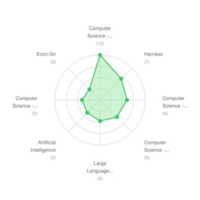
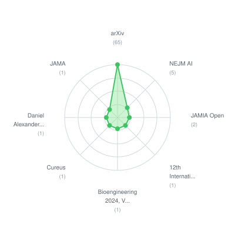

# Reading List

Papers I'm reading, synced from my [Zotero](https://www.zotero.org/) library.

68 papers read in the last year

## September 2026

- [Agent Lightning v1.0: Towards Harnessed Agentic RL](http://arxiv.org/abs/2608.17528) — He, Zhang, Zhou, Yang, Kang, Zhang, Qiu, Tsui, Xu, Luo (2026)
  > *Modern agents operate inside agent harnesses that manage tools, context, and control flow, making the harness a critical part of the agent system.*
- [Health-SCORE: Towards Scalable Rubrics for Improving Health-LLMs](http://arxiv.org/abs/2601.18706) — Yang, Janghorbani, Zhang, Han, Qian, Ressler, Lyng, Batra, Tillman (2026)
  > *Rubrics are essential for evaluating open-ended LLM responses, especially in safety-critical domains such as healthcare.*

## August 2026

- [The Lifecycle of LLM-as-a-Judge for Large-Scale Recommendation Explanations](http://arxiv.org/abs/2608.18300) — Kong, Tan, Gupta, Olds, Campbell, Fagnan, Kavuri, Balin, Gosain, Garcia, Jang (2026)
  > *LLM-as-a-Judge, which leverages a large language model to evaluate natural language generated by another AI application or model, has become a standard, scalable approach for accelerating and...*
- [Prime Agent: A Self-Improving RLM Harness](http://arxiv.org/abs/2608.23552) — Karten, Zhang, Thomas, Müller, Bakouch, Auras, Senghaas, Obeid, Dunas, Hagemann, Jaghouar (2026)
  > *Language models are sequential processors, but long-horizon agency requires external information and computation beyond model weights and active context.*
- [From Model Scaling to System Scaling: Scaling the Harness in Agentic AI](http://arxiv.org/abs/2605.26112) — Gu (2026)
  > *This paper studies the next major bottleneck in agentic AI as system scaling, not only model scaling: the design of auditable, persistent, modular, and verifiable architectures around foundation...*
- Double Blind Evals: Resolving the Dual Confidentiality Dilemma in AI Safety Auditing — Trask, Messing, Pahwa, Maham, Kolga, Frantz, Tash, Thomas, McGregor, Balston, Paskov, Brundage, Vij, Hillenbrand, Karargyris, Acosta, Fenster, Eilish, Elasmar, Khan, Gabriel, Werneck, Strahm, McDonough, Falcon, Lum, Isaac
  > *AI safety evaluations often involve sensitive prompts and proprietary models.*
- [AutoSaddler: Automatic Harness Optimization with Durable Updates from Agent Execution Traces](https://arxiv.org/abs/2608.23041) — Park, Kim, Tan, Zhang, Han, Gao, Park, Yao, Fu, Nallipogu, Lin, Rajmohan, Zhang (2026)
  > *LLM agents remain unreliable on long-horizon tasks, where small local failures can compound over extended interactions and lead to overall task failure.*
- [DiffusionGemma Technical Report TEXT DIFFUSION MODEL DiffusionGemma AR MODEL Supervised Finetuning (SFT) STEP 2 Sampler Distillation & Reinforcement Learning (SD⋅RL)](https://arxiv.org/abs/2608.00146v1) — Team, DeepMind (2026)
  > *We introduce DiffusionGemma, an experimental open-weight language model that uses discrete diffusion to generate text at exceptionally high speed.*
- [ToolPrivacyBench: Benchmarking Purpose-Bound Privacy in Tool-Using LLM Agents ⋆](https://arxiv.org/abs/2606.28061v1) — Hu, Liu, Meng, Zhao
  > *Large language models (LLMs) have increasingly moved from standalone text generation systems to agents that invoke external tools, access environments, and execute multi-step tasks.*
- Medical AI has a measurement problem (2026)
  > *The development of two medical AI assistants highlights an unnerving challenge: as the technology races ahead, what is the best way to evaluate what works?*

## July 2026

- [Retrieval Augmented Generation Enabled Generative Pre-Trained Transformer 4 (GPT-4) Performance for Clinical Trial Screening](https://doi.org/10.1101/2024.02.08.24302376) — Unlu, Shin, Mailly, Oates, Tucci, Varugheese, Wagholikar, Wang, Scirica, Blood, Aronson
- [Retrieval-Augmented Generation–Enabled GPT-4 for Clinical Trial Screening](https://doi.org/10.1056/AIOA2400181) — Unlu, Shin, Mailly, Oates, Tucci, Varugheese, Wagholikar, Wang, Scirica, Blood, Aronson (2024)
  > *Screening participants in clinical trials is an error-prone and labor-intensive process that requires significant time and resources.*
- [Retrieval-Augmented Generation–Enabled GPT-4 for Clinical Trial Screening](https://doi.org/10.1056/AIOA2400181) — Unlu, Shin, Mailly, Oates, Tucci, Varugheese, Wagholikar, Wang, Scirica, Blood, Aronson (2024)
  > *Screening participants in clinical trials is an error-prone and labor-intensive process that requires significant time and resources.*
- [Manual vs AI-Assisted Prescreening for Trial Eligibility Using Large Language Models—A Randomized Clinical Trial](https://jamanetwork.com/journals/jama/fullarticle/2830514) — Unlu, Varugheese, Shin, Subramaniam, Stein, St Laurent, Mailly, McPartlin, Wang, Oates, Cannon, Scirica, Wagholikar, Aronson, Blood (2025)
- [Nature Medicine nature medicine Generative AI-enabled clinical decision support system in primary care: a pragmatic, cluster-randomized trial](https://doi.org/10.1038/s41591-026-04503-6) — Agweyu, Mwaniki, Menon, Korom, Isaaka, Wanyama, Gill, Kiptinness, Adan, Emmanuel-Fabula, Riley, Archer, Denniston, Liu, Mateen
  > *Rigorous evidence on the performance of large language models (LLMs) in real-world, low-resource clinical settings remains limited.*

## June 2026

- [The Illusion of Readiness in Health AI](https://arxiv.org/abs/2509.18234v3) — Gu, Fu, Liu, Maria, Valanarasu, Codella, Tan, Liu, Jin, Zhang, Wang, Wang, Song, Qin, Usuyama, Wong, Cheng, Lee, Sanapathi, Hilado, Naumann, Alvarez-Valle, Bian, Wei, Malik, Zhou, Gao, Horvitz, Lungren, Burger, Topol, Poon, Vozila (2025)
  > *Large language models have demonstrated remarkable performance in a wide range of medical benchmarks.*
- [Towards autonomous medical artificial intelligence agents](https://www.nature.com/articles/s41586-026-10675-5) — Ferber, Hilgers, Höper, Kinny-Köster, Eckardt, Egger-Heidrich, Bill, Schneider, Clusmann, Kadric, Oehme, Mayrhofer-Schmid, Oeser, Wölflein, Wiest, Middeke, Iafrate, Truhn, Jäger, Kather (2026)
  > *Large language models (LLMs) show great potential for clinical decision-making, yet most applications remain narrow, task-specific chat tools rather than systems integrated into clinical workflows1,2.*
- 2O24 Clinical Research Site Challenges Report Data-Driven Insights on Current Site Challenges and Strategic Recommendations to Overcome Barriers and Boost Clinical Trial Efficiency — Clinical (2024)
- [Integrating clinical research into electronic health record workflows to support a learning health system](https://dx.doi.org/10.1093/jamiaopen/ooae023) — Goldhaber, Jacobs, Laurent, Knight, Zhu, Pham, Tran, Patel, Hogarth, Longhurst (2024)
  > *Objective: Integrating clinical research into routine clinical care workflows within electronic health record systems (EHRs) can be challenging, expensive, and labor-intensive.*
- [AutoMedPrompt: A New Framework for Optimizing LLM Medical Prompts Using Textual Gradients](https://arxiv.org/abs/2502.15944v1) — Wu, Koo, Scalzo, Kurtz
  > *Large language models (LLMs) have demonstrated increasingly sophisticated performance in medical and other fields of knowledge.*
- A Systematic Survey of Automatic Prompt Optimization Techniques — Ramnath, Zhou, Guan, Mishra, Qi, Shen, Wang, Woo, Jeoung, Wang, Wang, Ding, Lu, Xu, Zhou, Srinivasan, Yan, Chen, Ding, Xu, Cheong
  > *Since the advent of large language models (LLMs), prompt engineering has been a crucial step for eliciting desired responses for various Natural Language Processing (NLP) tasks.*
- [General-purpose large language models outperform specialized clinical AI tools on medical benchmarks](https://doi.org/10.1038/s41591-026-04431-5) — Vishwanath, Alyakin, Ghosh, Hage, Neifert, Orillac, Mandelberg, Khan, Lee, Yao, Robert
  > *We quantitatively evaluate two clinical AI tools, OpenEvidence and UpToDate Expert AI, built on large language models (LLMs) against three frontier LLMs: GPT-5.2, Gemini 3.1 Pro and Claude Opus 4.6.*
- [Measuring what Matters: Construct Validity in Large Language Model Benchmarks](https://arxiv.org/abs/2511.04703v1) — Bean, Kearns, Romanou, Hafner, Mayne, Batzner, Foroutan, Schmitz, Korgul, Batra, Deb, Beharry, Emde, Foster, Gausen, Grandury, Han, Hofmann, Ibrahim, Kim, Kirk, Lin, Kaili, Liu, Luettgau, Magomere, Rystrøm, Sotnikova, Yang, Zhao, Bibi, Bosselut, Clark, Cohan, Foerster, Gal, Hale, Raji, Summerfield, Torr, Ududec, Rocher, Mahdi
  > *Evaluating large language models (LLMs) is crucial for both assessing their capabilities and identifying safety or robustness issues prior to deployment.*
- [Medical Large Language Model Benchmarks Should Prioritize Construct Validity](https://arxiv.org/abs/2503.10694v1) — Alaa, Hartvigsen, Golchini, Dutta, Dean, Raji, Zack (2025)
  > *Medical large language models (LLMs) research often makes bold claims, from encoding clinical knowledge to reasoning like a physician.*
- [Large Language Models as Optimizers](https://arxiv.org/abs/2309.03409) — Yang, Wang, Lu, Liu, Le, Zhou, Chen (2023)
  > *Optimization is ubiquitous.*
- [SELF-REFINE: Iterative Refinement with Self-Feedback](https://selfrefine.info/) — Madaan, Tandon, Gupta, Hallinan, Gao, Wiegreffe, Alon, Dziri, Prabhumoye, Yang, Gupta, Majumder, Hermann, Welleck, Yazdanbakhsh, Clark
  > *Like humans, large language models (LLMs) do not always generate the best output on their first try.*
- [Encouraging Divergent Thinking in Large Language Models through Multi-Agent Debate](https://github.) — Liang, He, Jiao, Wang, Wang, Wang, Yang, Shi, Tu
  > *Modern large language models (LLMs) like ChatGPT have shown remarkable performance on general language tasks but still struggle on complex reasoning tasks, which drives the research on cognitive...*
- [APEX-Agents](https://arxiv.org/abs/2601.14242v3) — Vidgen, Mann, Fennelly, Wright, Lucas, Burstein, Benchek, Ostrofsky, Ravichandran, Sur, Venugopal, Hsia, Robinson, Huang, Varones, Khan, Haines, Bridges, Boyle, Twist, Richards, Mahapatra, Foody, Mercor
  > *We introduce the AI Productivity Index for Agents (APEX-Agents), a benchmark for assessing whether AI agents can execute long-horizon, cross-application tasks created by investment banking analysts,...*
- [APEX-Agents](https://arxiv.org/abs/2601.14242v3) — Vidgen, Mann, Fennelly, Wright, Lucas, Burstein, Benchek, Ostrofsky, Ravichandran, Sur, Venugopal, Hsia, Robinson, Huang, Varones, Khan, Haines, Bridges, Boyle, Twist, Richards, Mahapatra, Foody, Mercor
  > *We introduce the AI Productivity Index for Agents (APEX-Agents), a benchmark for assessing whether AI agents can execute long-horizon, cross-application tasks created by investment banking analysts,...*
- [The AI Productivity Index (APEX)](https://arxiv.org/abs/2509.25721v1) — Vidgen, Fennelly, Pinnix, Benchek, Khan, Richards, Bridges, Huang, Sahu, Kottamasu, Ma, Hunsberger, Robinson, Datta, Mahapatra, Barton, Sunstein, Topol, Foody, Nitski (2025)
  > *We present an extended version of the AI Productivity Index (APEX-v1-extended), a benchmark for assessing whether frontier models are capable of performing economically valuable tasks in four jobs:...*
- [OpenAIs HealthBench in Action: Evaluating an LLM-Based Medical Assistant on Realistic Clinical Queries](https://arxiv.org/abs/2509.02594v1) — Ravichandran, Kumar, Corga, Silva, Romano, Berkels, Van Der Heijden, Fail, Gnanapragasam (2026)
  > *Evaluating large language models (LLMs) on their ability to generate high-quality, accurate, situationally aware answers to clinical questions requires going beyond conventional benchmarks to assess...*

## May 2026

- [LINEARRAG: LINEAR GRAPH RETRIEVAL AUG-MENTED GENERATION ON LARGE-SCALE CORPORA](https://github.com/DEEP-PolyU/LinearRAG.git.) — Zhuang, Chen, Xiao, Zhou, Zhang, Chen, Zhang, Huang
  > *Retrieval-Augmented Generation (RAG) is widely used to mitigate hallucinations of Large Language Models (LLMs) by leveraging external knowledge.*
- [LinearRAG: Linear Graph Retrieval Augmented Generation on Large-scale Corpora](https://arxiv.org/abs/2510.10114) — Zhuang, Chen, Xiao, Zhou, Zhang, Chen, Zhang, Huang (2025)
  > *Retrieval-Augmented Generation (RAG) is widely used to mitigate hallucinations of Large Language Models (LLMs) by leveraging external knowledge.*

## April 2026

- [Almanac — Retrieval-Augmented Language Models for Clinical Medicine](https://ai.nejm.org/doi/full/10.1056/AIoa2300068) — Zakka, Shad, Chaurasia, Dalal, Kim, Moor, Fong, Phillips, Alexander, Ashley, Boyd, Boyd, Hirsch, Langlotz, Lee, Melia, Nelson, Sallam, Tullis, Vogelsong, Cunningham, Hiesinger (2024)
  > *Large-language models have recently demonstrated impressive zero-shot capabilities in a variety of natural language tasks such as summarization, dialogue generation, and question-answering.*
- [Emergent Misalignment: Narrow finetuning can produce broadly misaligned LLMs](http://arxiv.org/abs/2502.17424) — Betley, Tan, Warncke, Sztyber-Betley, Bao, Soto, Labenz, Evans (2026)
  > *We present a surprising result regarding LLMs and alignment.*
- [Meta-Harness: End-to-End Optimization of Model Harnesses TerminalBench-2 Harness Performance](https://yoonholee.com/meta-harness/) — Lee Stanford Roshen Nair Stanford Qizheng Zhang Stanford Kangwook Lee, Khattab, Finn Stanford
  > *Project page w/ interactive demo: https://yoonholee.com/meta-harness/ Optimized harness: https://github.com/stanford-iris-lab/meta-harness-tbench2-artifact Human-written Model-optimized (ours) Figure...*
- [Crashing Waves vs. Rising Tides: Preliminary Findings on AI Automation from Thousands of Worker Evaluations of Labor Market Tasks](https://arxiv.org/abs/2604.01363) — Mertens, Kuzee, Futuretech, Harris, Lyu, Li, Rosenfeld, Anto, Fleming, Thompson (2026)
  > *We propose that AI automation is a continuum between: (i) crashing waves where AI capabilities surge abruptly over small sets of tasks, and (ii) rising tides where the increase in AI capabilities is...*
- Forecasting the Economic Effects of AI * — Karger, Kuusela, Abaluck, Bryan, Halperin, Jones, Murphy, Trammell, Reynolds, Mayland, Viswanathan, Mittal, Ceppas de Castro, Rosenberg, Tetlock, Reddy, Holton, Schmidt (2026)
  > *We elicit forecasts of how AI will affect the U.S.*
- [Mapping AI into Production: A Field Experiment on Firm Performance](https://papers.ssrn.com/abstract=6513481) — Kim, Kim, Koning (2026)
  > *
AI can deliver productivity gains on individual tasks, yet evidence on whether these gains aggregate to firm performance remains limited.*
- [Embarrassingly Simple Self-Distillation Improves Code Generation](https://arxiv.org/abs/2604.01193) — Zhang, Bai, Zheng, Jaitly, Collobert, Zhang (2026)
  > *Can a large language model (LLM) improve at code generation using only its own raw outputs, without a verifier, a teacher model, or reinforcement learning? We answer in the affirmative with simple...*
- [AI Must Embrace Specialization via Superhuman Adaptable Intelligence](https://arxiv.org/abs/2602.23643v1) — Goldfeder, Wyder, Lecun, Shwartz-Ziv
  > *Everyone from AI executives and researchers to doomsayers, politicians, and activists is talking about Artificial General Intelligence (AGI).*

## March 2026

- Composer 2 Technical Report
- [Qwen3 Technical Report](https://huggingface.co/Qwenhttps://modelscope.cn/organization/qwenhttps://github.com/QwenLM/Qwen3) — Team (2025)
  > *In this work, we present Qwen3, the latest version of the Qwen model family.*
- [PostTrainBench: Can LLM Agents Automate LLM Post-Training?](http://arxiv.org/abs/2603.08640) — Rank, Bhatnagar, Prabhu, Eisenberg, Nguyen, Bethge, Andriushchenko (2026)
  > *AI agents have become surprisingly proficient at software engineering over the past year, largely due to improvements in reasoning capabilities.*
- [What Matters in Data for DPO?](http://arxiv.org/abs/2508.18312) — Pan, Cai, Chen, Zhong, Wang (2025)
  > *Direct Preference Optimization (DPO) has emerged as a simple and effective approach for aligning large language models (LLMs) with human preferences, bypassing the need for a learned reward model.*
- When AI Builds AI Findings From a Workshop on Automation of AI R&D — Fisher, Scholl, Wildeford, Greenblatt, Albanie, Ballard, Larsen, Toner, Beers, Newman, Khan, Shea-Blymyer, Yee, Acharya (2026)

## February 2026

- [Artificial Hivemind: The Open-Ended Homogeneity of Language Models (and Beyond)](https://arxiv.org/abs/2510.22954v1) — Jiang, Chai, Li, Liu, Fok, Dziri, Tsvetkov, Sap, Albalak, Choi
  > *Large language models (LMs) often struggle to generate diverse, human-like creative content, raising concerns about the long-term homogenization of human thought through repeated exposure to similar...*
- [ChatDoctor: A Medical Chat Model Fine-Tuned on a Large Language Model Meta-AI (LLaMA) Using Medical Domain Knowledge](https://cureus.com/articles/152858-chatdoctor-a-medical-chat-model-fine-tuned-on-a-large-language-model-meta-ai-llama-using-medical-domain-knowledge) — Li, Li, Zhang, Dan, Jiang, Zhang, Li, Li, Zhang, Dan, Jiang, Zhang (2023)
  > *The primary aim of this research was to address the limitations observed in the medical knowledge of prevalent large language models (LLMs) such as ChatGPT, by creating a specialized language model...*
- NVIDIA Nemotron 3: Efficient and Open Intelligence — Mamba

## January 2026

- [End-to-End Test-Time Training for Long Context](https://arxiv.org/abs/2512.23675v2) — Tandon, Dalal, Li, Koceja, Rød, Buchanan, Wang, Leskovec, Koyejo, Hashimoto, Guestrin, Mccaleb, Choi, Sun
  > *We formulate long-context language modeling as a problem in continual learning rather than architecture design.*
- [Towards LLMs Robustness to Changes in Prompt Format Styles](https://arxiv.org/abs/2504.06969) — Ngweta, Kate, Tsay, Rizk (2025)
  > *Large language models (LLMs) have gained popularity in recent years for their utility in various applications.*
- A.I. and Our Economic Future — Jones, Gsb (2026)
  > *Artificial intelligence (A.I.) will likely be the most important technology we have ever developed.*
- [Qwen3-TTS Technical Report](https://arxiv.org/abs/2601.15621) — Hu, Zhu, He, Guo, Zhang, Wang, Guo, Jiang, Hao, Guo, Zhang, Zhang, Yang, Xu, Zhou, Lin (2026)
  > *In this report, we present the Qwen3-TTS series, a family of advanced multilingual, controllable, robust, and streaming text-to-speech models.*
- [GAN-Based Approach for Diabetic Retinopathy Retinal Vasculature Segmentation](https://www.mdpi.com/2306-5354/11/1/4/htm) — Sebastian, Elharrouss, Al-Maadeed, Almaadeed (2023)
  > *Most diabetes patients develop a condition known as diabetic retinopathy after having diabetes for a prolonged period.*
- [MedHELM: Holistic Evaluation of Large Language Models for Medical Tasks](https://arxiv.org/abs/2505.23802) — Bedi, Cui, Fuentes, Unell, Wornow, Banda, Kotecha, Keyes, Mai, Oez, Qiu, Jain, Schettini, Kashyap, Fries, Swaminathan, Chung, Nateghi, Aali, Nayak, Vedak, Jain, Patel, Fayanju, Shah, Goh, Yao, Soetikno, Reis, Gatidis, Divi, Capasso, Saralkar, Chiang, Jindal, Pham, Ghoddusi, Lin, Chiou, Hong, Roy, Gensheimer, Patel, Schulman, Dash, Char, Downing, Grolleau, Black, Mieso, Zahedivash, Yim, Sharma, Lee, Kirsch, Lee, Ambers, Lugtu, Sharma, Mawji, Alekseyev, Zhou, Kakkar, Helzer, Revri, Bannett, Daneshjou, Chen, Alsentzer, Morse, Ravi, Aghaeepour, Kennedy, Chaudhari, Wang, Koyejo, Lungren, Horvitz, Liang, Pfeffer, Shah (2025)
  > *While large language models (LLMs) achieve near-perfect scores on medical licensing exams, these evaluations inadequately reflect the complexity and diversity of real-world clinical practice.*
- [International Retrospective Observational Study of Continual Learning for AI on Endotracheal Tube Placement from Chest Radiographs](https://ai.nejm.org/doi/full/10.1056/AIoa2500522) — Chen, Saenz, Banerjee, Marklund, Zhang, Johri, Zhou, Luo, Adithan, Wu, Dogra, Reddi, Buensalido, Kavnoudias, Kloeckner, Müller, Salinas-Miranda, Vega, Kolck, Penzkofer, Ueda, Walston, Quispe-Cornejo, Salvagno, Lee, Fournier, Castillo, Luna, Bahramipour, Zuback, Braren, Jiraskova, Wannasopha, Khumrin, Wei, Hallinan, Jiao, Yi, Martinez, Alarcon, Fellner, Niedermair, Wu, Kim, Haubold, Heiliger, Pérez-Chada, Pratesi, Cummings, Razavian, Oikonomou, Tran, Küstner, Afat, Dula, Rousseau, Hržić, Fuchsjäger, Rajpurkar (2025)
  > *Medical artificial intelligence (AI) models often underperform when deployed at new hospitals despite strong performance during development, creating a need for effective adaptation strategies that...*
- [Sequential Diagnosis with Language Models](https://arxiv.org/abs/2506.22405v1) — Nori, Daswani, Kelly, Lundberg, Ribeiro, Wilson, Liu, Sounderajah, Carlson, Lungren, Gross, Hames, Suleyman, King, Horvitz (2025)
  > *Artificial intelligence holds great promise for expanding access to expert medical knowledge and reasoning.*
- [Human–AI collectives most accurately diagnose clinical vignettes](https://doi.org/10.1073/PNAS.2426153122;WGROUP:STRING:PUBLICATION) — Zöller, Berger, Lin, Fu, Komarneni, Barabucci, Laskowski, Shia, Harack, Chu, Trianni, Kurvers, Herzog (2025)
  > *AI systems, particularly large language models (LLMs), are increasingly being employed in high-stakes decisions that impact both individuals and society at large, often without adequate safeguards to...*
- [Training LLMs for EHR-Based Reasoning Tasks via Reinforcement Learning](https://arxiv.org/abs/2505.24105v1) — Lin, Wu, Sun (2025)
  > *We present EHRMIND, a practical recipe for adapting large language models (LLMs) to complex clinical reasoning tasks using reinforcement learning with verifiable rewards (RLVR).*
- [FLEMING-R1: TOWARD EXPERT-LEVEL MEDICAL REASONING VIA REINFORCEMENT LEARNING](https://github.com/UbiquantAI/Fleming-R1) — Liu, Li, Shu, Chen, Duan, Fang, Dai
  > *While large language models show promise in medical applications, achieving expert-level clinical reasoning remains challenging due to the need for both accurate answers and transparent reasoning...*
- [Med-U1: Incentivizing Unified Medical Reasoning in LLMs via Large-scale Reinforcement Learning](https://arxiv.org/abs/2506.12307v1) — Zhang, Wang, Feng, Chen, Zhou, Zhang, Xu, Wu, Liu (2025)
  > *Medical Question-Answering (QA) encompasses a broad spectrum of tasks, including multiple choice questions (MCQ), open-ended text generation, and complex computational reasoning.*
- [Beyond Distillation: Pushing the Limits of Medical LLM Reasoning with Minimalist Rule-Based RL](https://arxiv.org/abs/2505.17952v1) — Liu, Wang, Pan, Wan, Dai, Lin, Bai, Rueckert, Arcucci (2025)
  > *Improving performance on complex tasks and enabling interpretable decision making in large language models (LLMs), especially for clinical applications, requires effective reasoning.*
- [Reward Hacking Mitigation using Verifiable Composite Rewards](https://github.com/healthylaife/Composite-LLM-Reward-Model) — Farhan Bin Tarek
  > *Reinforcement Learning from Verifiable Rewards (RLVR) has recently shown that large language models (LLMs) can develop their own reasoning without direct supervision.*
- [Med-RLVR: Emerging Medical Reasoning from a 3B base model via reinforcement Learning](https://arxiv.org/abs/2502.19655v1) — Zhang, Liu, Qin, Naumann, Poon, Beginning (2025)
  > *Reinforcement learning from verifiable rewards (RLVR) has recently gained attention for its ability to elicit self-evolved reasoning capabilitie from base language models without explicit reasoning...*
- [A Primer on Reinforcement Learning in Medicine for Clinicians Check for updates](https://doi.org/10.1038/s41746-024-01316-0) — Jayaraman, Desman, Sabounchi, Nadkarni, Sakhuja
  > *Reinforcement Learning (RL) is a machine learning paradigm that enhances clinical decision-making for healthcare professionals by addressing uncertainties and optimizing sequential treatment...*
- The promises and pitfalls of reinforcement learning in healthcare 1 — Gottesman, Johansson, Komorowski, Faisal, Sontag, Doshi-Velez, Celi

## October 2025

- [GraphMERT: Efficient and Scalable Distillation of Reliable Knowledge Graphs from Unstructured Data](https://arxiv.org/abs/2510.09580v1) — Belova, Xiao, Tuli, Jha (2025)
  > *Researchers have pursued neurosymbolic artificial intelligence (AI) applications for nearly three decades because symbolic components provide abstraction while neural components provide...*
- [Triton: An Intermediate Language and Compiler for Tiled Neural Network Computations](https://doi.org/10.1145/3315508.3329973) — Tillet, Kung, Cox (2019)
  > *The validation and deployment of novel research ideas in the field of Deep Learning is often limited by the availability of efficient compute kernels for certain basic primitives.*

## August 2025

- [Generative Medical Event Models Improve with Scale](https://cosmos.epic.com) — Waxler, Blazek, White, Sneider, Chung, Nagarathnam, Williams, Voeller, Wong, Swanhorst, Zhang, Usuyama, Wong, Naumann, Poon, Loza, Meeker, Hain, Shah
  > *Realizing personalized medicine at scale calls for methods that distill insights from longitudinal patient journeys, which can be viewed as a sequence of medical events.*
- [Small Language Models are the Future of Agentic AI](https://arxiv.org/abs/2506.02153v1) — Belcak, Heinrich, Diao, Fu, Dong, Muralidharan, Lin, Molchanov (2025)
  > *Large language models (LLMs) are often praised for exhibiting near-human performance on a wide range of tasks and valued for their ability to hold a general conversation.*
- [The wall confronting large language models](https://arxiv.org/abs/2507.19703v2) — Coveney, Succi (2025)
  > *We show that the scaling laws which determine the performance of large language models (LLMs) severely limit their ability to improve the uncertainty of their predictions.*
- [TheAgentCompany: Benchmarking LLM Agents on Consequential Real World Tasks](https://github.com/TheAgentCompany/experiments) — Xu, Song, Li, Tang, Jain, Bao, Wang, Zhou, Guo, Cao, Yang, Lu, Martin, Su, Melroy Maben, Mehta, Chi, Jang, Xie, Zhou, Neubig
  > *We interact with computers on an everyday basis, be it in everyday life or work, and many aspects of work can be done entirely with access to a computer and the Internet.*

## June 2025

- Expertise Is What We Want — Al-Dajani, Health Keegan Duchicela, Kafadarov, Health Othman Laraki, Lazrak, Health Wendy McKennon, Health Rebecca Miksad, Health Jayodita Sanghvi, Health Alan Ashworth, Mandair, Zack, Kurian Stanford
  > *Clinical decision-making depends on expert reasoning, which is guided by standardized, evidence-based guidelines.*
- [Language Models are Super Mario: Absorbing Abilities from Homologous Models as a Free Lunch](http://arxiv.org/abs/2311.03099) — Yu, Yu, Yu, Huang, Li (2024)
  > *In this paper, we unveil that Language Models (LMs) can acquire new capabilities by assimilating parameters from homologous models without retraining or GPUs.*

## May 2025

- [Aloe: A Family of Fine-tuned Open Healthcare LLMs](https://arxiv.org/abs/2405.01886v1) — Kumar Gururajan, Lopez-Cuena, Bayarri-Planas, Tormos, Hinjos, Bernabeu-Perez, Arias-Duart, Martin-Torres, Urcelay-Ganzabal, Gonzalez-Mallo, Alvarez-Napagao, Ayguadé-Parra, Cortés, Garcia-Gasulla
  > *As the capabilities of Large Language Models (LLMs) in healthcare and medicine continue to advance, there is a growing need for competitive open-source models that can safeguard public interest.*
- [Transforming appeal decisions: machine learning triage for hospital admission denials](https://dx.doi.org/10.1093/jamiaopen/ooaf016) — Owolabi (2024)
  > *Objective: To develop and validate a machine learning model that helps physician advisors efficiently identify hospital admission denials likely to be overturned on appeal.*

## April 2025

- [Surpassing GPT-4 Medical Coding with a Two-Stage Approach](https://arxiv.org/abs/2311.13735v1) — Yang, Stremmel, Halperin (2023)
  > *Recent advances in large language models (LLMs) show potential for clinical applications, such as clinical decision support and trial recommendations.*

## March 2025

- [WHEN SCALING MEETS LLM FINETUNING: THE EFFECT OF DATA, MODEL AND FINETUNING METHOD](https://arxiv.org/abs/2402.17193v1) — Zhang, Liu, Cherry, Firat, Deepmind, Research
  > *While large language models (LLMs) often adopt finetuning to unlock their capabilities for downstream applications, our understanding on the inductive biases (especially the scaling properties) of...*
- [O1 Replication Journey -- Part 3: Inference-time Scaling for Medical Reasoning](http://arxiv.org/abs/2501.06458) — Huang, Geng, Hua, Huang, Zou, Zhang, Liu, Zhang, Jiao Tong University (2025)
  > *Building upon our previous investigations of O1 replication (Part 1: Journey Learning [Qin et al., 2024] and Part 2: Distillation [Huang et al., 2024]), this work explores the potential of...*

## February 2025

- [Improving Attributed Text Generation of Large Language Models via Preference Learning](https://arxiv.org/abs/2403.18381v1) — Li, Sun, Hu, Liu, Hu, Liu, Zhang
  > *Large language models have been widely adopted in natural language processing, yet they face the challenge of generating unreliable content.*
- [Training Language Models to Generate Text with Citations via Fine-grained Rewards](https://github.com/) — Huang, Wu, Hu, Wang
  > *While recent Large Language Models (LLMs) have proven useful in answering user queries, they are prone to hallucination, and their responses often lack credibility due to missing references to...*
- [Enabling Large Language Models to Generate Text with Citations](https://www.bing.com/new) — Gao, Jiatong, Chen
  > *Large language models (LLMs) have emerged as a widely-used tool for information seeking, but their generated outputs are prone to hallucination.*
- [Tülu 3: Pushing Frontiers in Open Language Model Post-Training](https://arxiv.org/abs/2411.15124v4) — Brahman, James Miranda, Liu, Dziri, Lyu, Gu, Malik, Graf, Hwang, Yang, Le Bras, Tafjord, Wilhelm, Soldaini, Smith, Wang, Dasigi, Hajishirzi (2025)
  > *Language model post-training is applied to refine behaviors and unlock new skills across a wide range of language models, but open recipes for applying these techniques lag behind proprietary ones.*
- [Large Language Models Are Poor Medical Coders — Benchmarking of Medical Code Querying](https://ai.nejm.org/doi/full/10.1056/AIdbp2300040) — Soroush, Glicksberg, Zimlichman, Barash, Freeman, Charney, Nadkarni, Klang (2024)
  > *Large language models (LLMs) have attracted significant interest for automated clinical coding.*
- [GENAUDIT: Fixing Factual Errors in Language Model Outputs with Evidence](https://genaudit.org) — Krishna, Ramprasad, Prakhar Gupta, Wallace, Lipton, Bigham
  > *LLMs can generate factually incorrect statements even when provided access to reference documents.*
- [Improving the Robustness of Summarization Models by Detecting and Removing Input Noise](https://arxiv.org/abs/2212.09928v2) — Krishna, Zhao, Ren, Lakshminarayanan, Luo, Saleh, Liu
  > *The evaluation of abstractive summarization models typically uses test data that is identically distributed as training data.*
- [Do We Still Need Clinical Language Models?](https://github.com/elehman16/clinical) — Lehman, Hernandez, Mahajan, Wulff, Smith, Ziegler, Nadler, Szolovits, Johnson, Ca, Alsentzer, Edu (2023)
  > *Although recent advances in scaling large language models (LLMs) have resulted in improvements on many NLP tasks, it remains unclear whether these models trained primarily with general web text are...*
- [DRG-LLaMA : tuning LLaMA model to predict diagnosis-related group for hospitalized patients](https://doi.org/10.1038/s41746-023-00989-3) — Wang, Gao, Dantona, Hull, Sun
  > *In the U.S.*
- [Zero-Shot Clinical Trial Patient Matching with LLMs](https://arxiv.org/abs/2402.05125v3) — Wornow, Lozano, Jindal, Mahaffey, Shah
  > *Background: Matching patients to clinical trials is a key unsolved challenge in bringing new drugs to market.*
- [KTO: Model Alignment as Prospect Theoretic Optimization](https://arxiv.org/abs/2402.01306v4) — Ethayarajh, Xu, Muennighoff, Jurafsky, Kiela (2024)
  > *Kahneman & Tversky's prospect theory tells us that humans perceive random variables in a biased but well-defined manner (1992); for example, humans are famously loss-averse.*
- [Distillation Scaling Laws](https://arxiv.org/abs/2502.08606v1) — Busbridge, Shidani, Weers, Ramapuram, Littwin, Webb
  > *We provide a distillation scaling law that estimates distilled model performance based on a compute budget and its allocation between the student and teacher.*
- [FlowMind: Automatic Workflow Generation with LLMs](https://doi.org/10.1145/3604237.3626908) — Zeng, Morgan, Watson, Cho, Rahimi, Reynolds, Balch, Veloso
  > *The rapidly evolving field of Robotic Process Automation (RPA) has made significant strides in automating repetitive processes, yet its effectiveness diminishes in scenarios requiring spontaneous or...*
- [Direct Preference Optimization: Your Language Model is Secretly a Reward Model](https://arxiv.org/abs/2305.18290v3) — Rafailov, Sharma, Mitchell, Ermon, Manning, Finn
  > *While large-scale unsupervised language models (LMs) learn broad world knowledge and some reasoning skills, achieving precise control of their behavior is difficult due to the completely unsupervised...*

## December 2024

- [Uncertainty Estimation and Quantification for LLMs: A Simple Supervised Approach](https://arxiv.org/abs/2404.15993v4) — Liu, Pan, Li, Chen
  > *In this paper, we study the problem of uncertainty estimation and calibration for LLMs.*
- [Uncertainty Quantification for In-Context Learning of Large Language Models](https://github.) — Ling, Zhao, Zhang, Cheng, Liu, Sun, Oishi, Osaki, Matsuda, Ji, Bai, Zhao, Chen
  > *In-context learning has emerged as a groundbreaking ability of Large Language Models (LLMs) and revolutionized various fields by providing a few task-relevant demonstrations in the prompt.*
- [An Unsupervised Approach to Achieve Supervised-Level Explainability in Healthcare Records](https://github.com/JoakimEdin/) — Edin, Borgholt, Maistro, Havtorn, Maaløe, Ruotsalo
  > *Electronic healthcare records are vital for patient safety as they document conditions, plans, and procedures in both free text and medical codes.*
- [Enhancing Large Language Models for Clinical Decision Support by Incorporating Clinical Practice Guidelines](https://arxiv.org/abs/2401.11120v2) — Oniani, Wu, Visweswaran, Kapoor, Kooragayalu, Polanska, Wang
  > *Background*
- [Automated clinical coding using off-the-shelf large language models](https://github.com/StefanoTrv/simple_icd_10_CM) — Boyle, Kascenas, Lok, Liakata, O'neil
  > *The task of assigning diagnostic ICD codes to patient hospital admissions is typically performed by expert human coders.*
- [Fine-Tuning LLMs for Specialized Use Cases](https://doi.org/10.1016/j.mcpdig.2024.11.005) — Malins, Friedman, Attia (2024)
  > *This is a PDF file of an article that has undergone enhancements after acceptance, such as the addition of a cover page and metadata, and formatting for readability, but it is not yet the definitive...*
- [Can the Administrative Loads of Physicians be Alleviated by AI-Facilitated Clinical Documentation?](https://doi.org/10.1007/s11606-024-08870-z) — Bundy, Gerhart, Baek, Connor, Isreal, Dharod, Stephens, Liu, Hetherington, Cleveland (2024)
  > *Background: Champions of AI-facilitated clinical documentation have suggested that the emergent technology may decrease the administrative loads of physicians, thereby reducing cognitive burden and...*

---

*Last synced: 2026-09-04*
